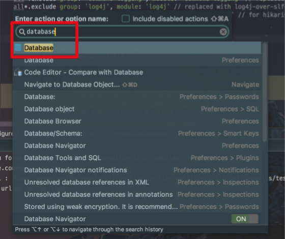
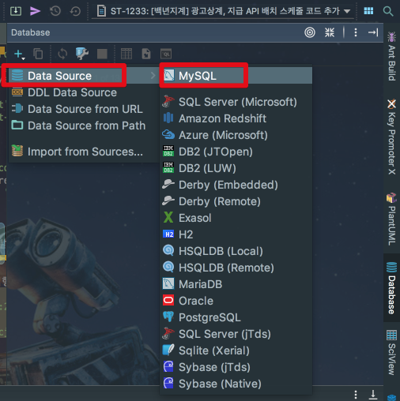
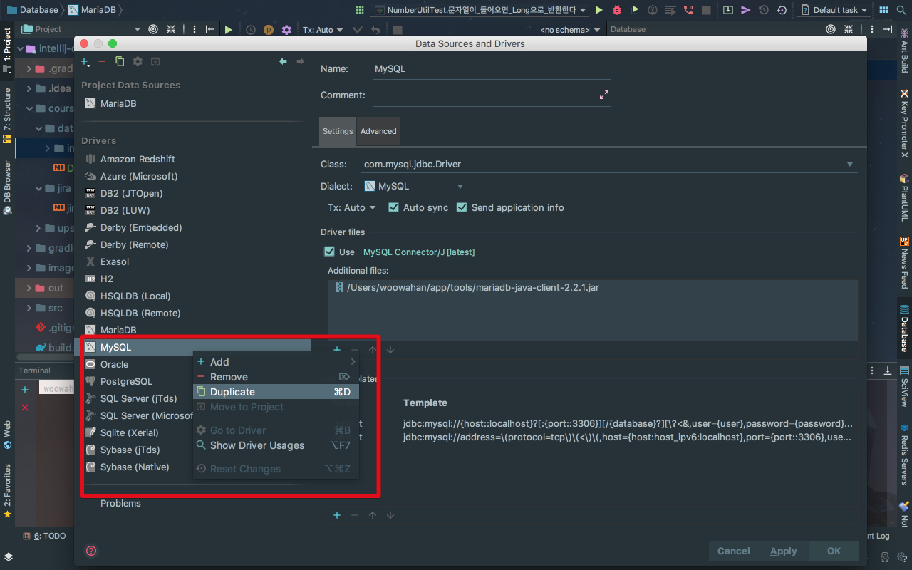
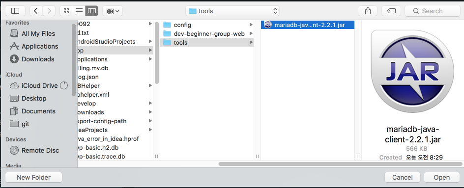
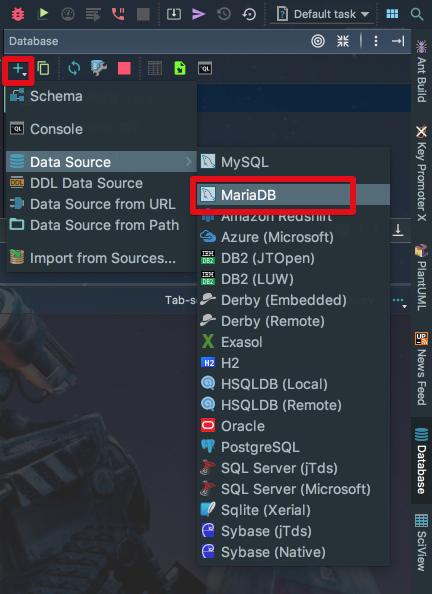
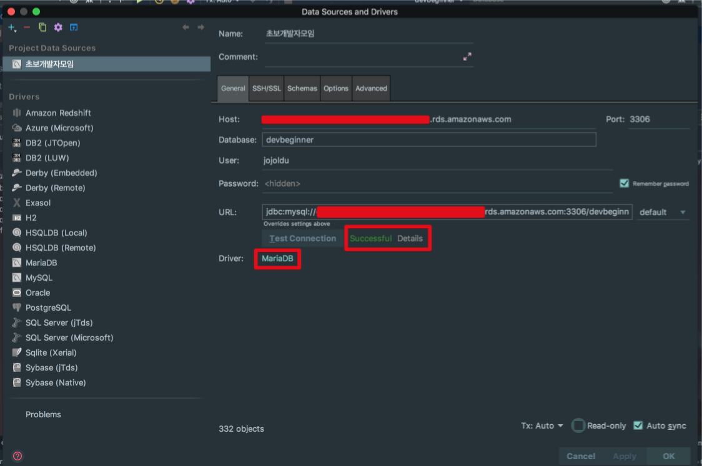

# IntelliJ에서 Maria DB 사용하기

IntelliJ의 Database Tool에는 기본적으로 MariaDB를 지원하지 않습니다.  
그래서 직접 Maria DB 설정이 필요합니다.  


[mariadb connector 사이트](https://mariadb.com/kb/en/library/about-mariadb-connector-j/)에서 jar 파일을 다운 받습니다.  


> Tip)  
현재(2018.01.20) 기준으로 2.2.1이 최신입니다.

jar 다운로드가 끝나시면, IntelliJ에서 ```command+shift+a``` 혹은 ```ctrl+shift+a```를 눌러 Action 검색창을 열겠습니다.  
검색창에서 ```database```를 입력해 Database Tool을 열겠습니다.



IntelliJ 우측에 Database Tool이 활성화되시면 ```+```버튼을 클릭해 **Data Source** -> **MySQL**을 선택합니다.



MySQL을 **우클릭** -> **Duplicate**를 선택하셔서 해당 **설정을 복사**합니다.



> Tip)  
MariaDB가 MySQL을 기반으로 했기 때문에 Connector를 제외한 나머지 옵션은 그대로 사용하시면 됩니다.

복사된 MySQL 설정에서 화면과 같이 **Additional files** -> ```+```버튼을 클릭해 maria db connector jar 파일을 추가합니다.




jar가 추가 되셨으면 아래와 같이 설정을 변경합니다.


* Name
  * Maria DB와 같이 DBMS 이름 추가
* Class
  * mariadb.jdbc.driver 선택
* Driver Files
  * **use** 체크 해제
  * Additional files에 maria jar 추가

설정이 완료되시면 다음과 같이 MaraiDB를 사용할수 있게 됩니다.



기존에 구축된 Maria DB에 접근할수 있도록 DataSource를 하나 추가해서 Test Connection을 해보시면!



성공입니다!  


