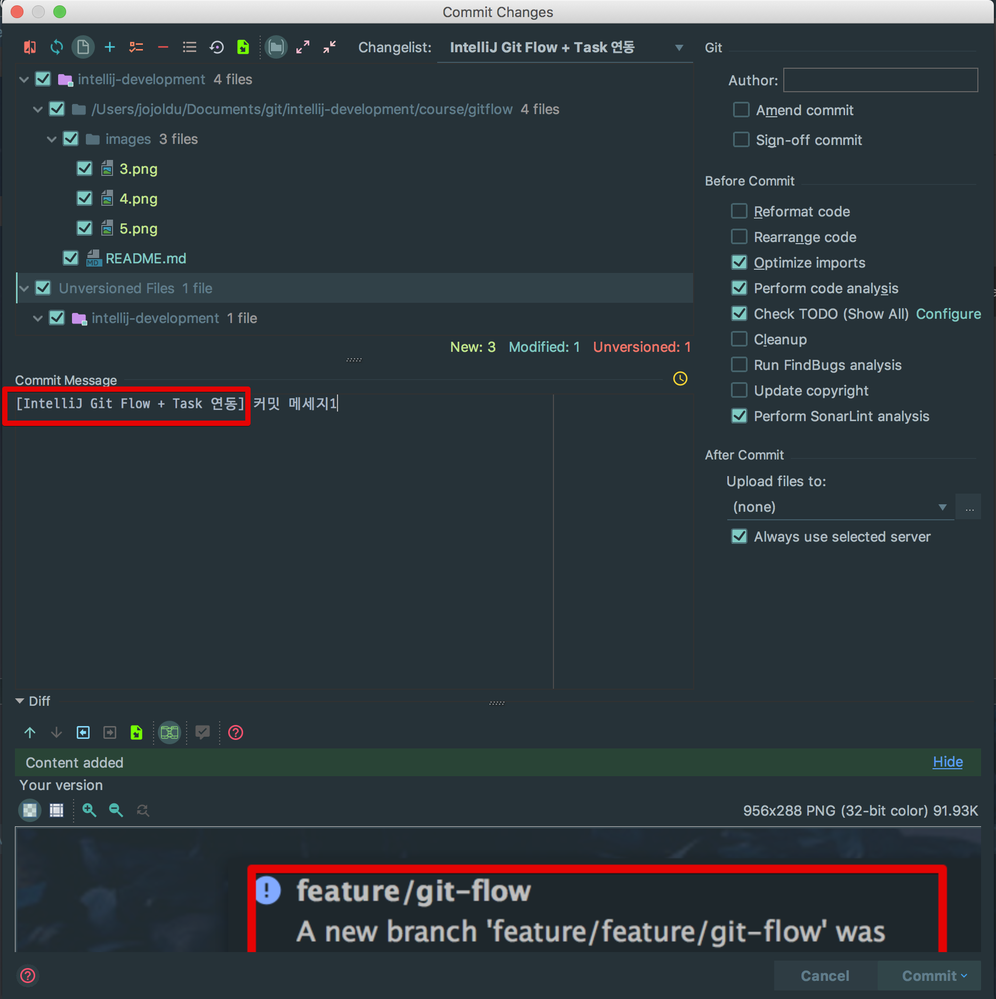
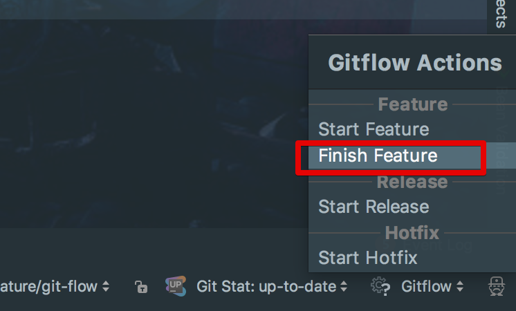
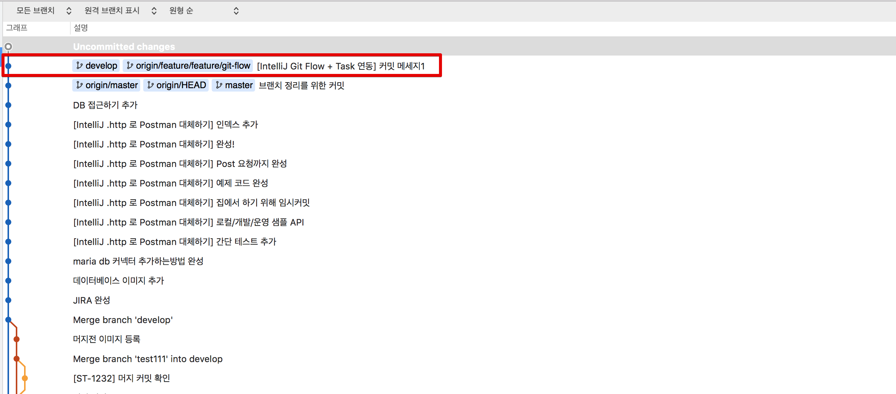
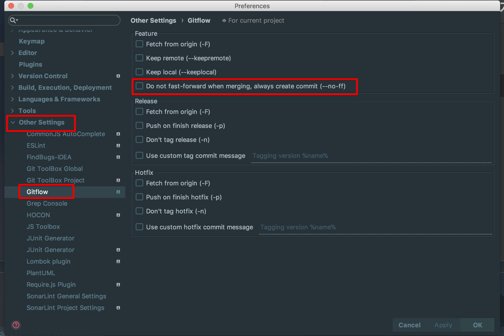
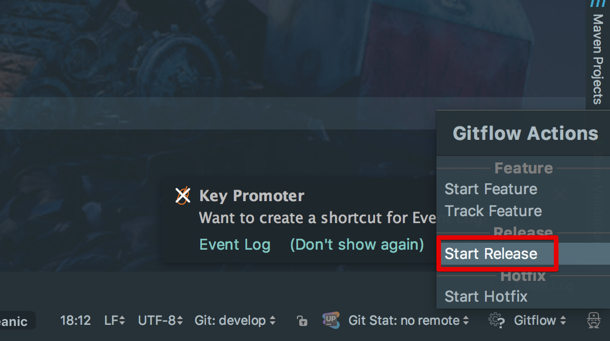
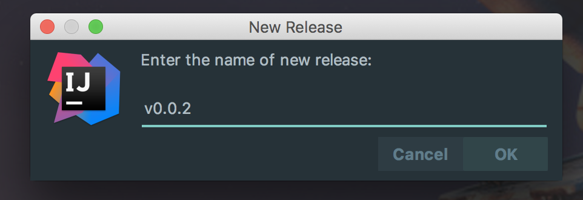
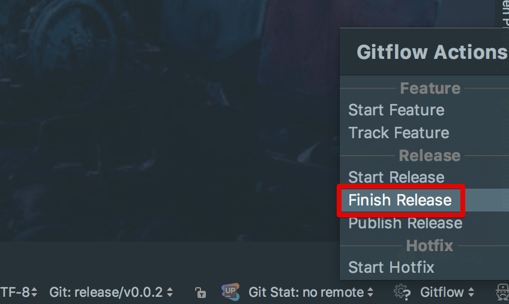
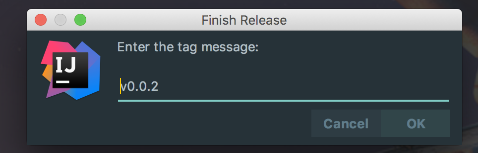
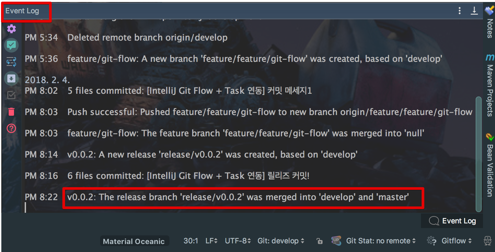

# Git Flow Integration으로 Git Flow 심플하게 운영하기

대부분의 회사에서 Git을 사용할 경우 [Git Flow](https://danielkummer.github.io/git-flow-cheatsheet/index.ko_KR.html)를 따릅니다.  
그러다보니 귀찮을때가 많습니다.  
단적인 예로 release 브랜치 작업이 끝난후 다음과 같은 작업이 진행됩니다.

* develop 브랜치로 스위칭 -> release 브랜치를 merge
* master 브랜치로 스위칭 -> release 브랜치를 merge 
* master 브랜치에 tag 추가
* release 브랜치 삭제
 
이런 작은 행위들이 크진 않지만 막상 할때마다 귀찮습니다.  
그래서 좀 더 편하게 한번에 할수 없을까 고민하다가 [IntelliJ Git Flow Integration](https://plugins.jetbrains.com/plugin/7315-git-flow-integration)을 발견하여 정리합니다.  

> Tip)  
Source Tree에서도 Git Flow를 지원합니다.  
자세한 내용은 [블로그](https://medium.com/@budioktaviyans/how-to-make-a-git-flow-using-sourcetree-20ab77fe6813) (영문) 을 참고하세요!  
이미지 중심이라 이해하시는데 크게 어려움이 없으실것 같습니다.

## 설치

맥 OS를 기준으로 homebrew를 통해 git flow를 먼저 설치합니다.

```bash
brew install git-flow
```

> Tip)  
다른 OS에서의 설치법은 [위키](https://github.com/petervanderdoes/gitflow-avh/wiki/Installation)를 참고하세요!
(개발환경 설치때마다 Mac OS 짱짱을 외칠수밖에 ㅠㅠ...)

git flow가 설치되셨으면 아래와 같이 ```Git Flow Integration``` 플러그인을 설치합니다.


IntelliJ를 재시작하시면 설치가 완료됩니다!

## 사용

저는 기본적으로 IntelliJ가 제공하는 **Task 기능을 함께 사용**합니다.  

> Tip)  
Task 기능이 궁금하시다면 이전에 [포스팅](http://jojoldu.tistory.com/260)한 내용을 참고해보세요!

플러그인 설치후 IntelliJ 우측 하단을 보시면 다음과 같이 No Gitflow가 보입니다.  


클릭하셔서 **Init Repo**를 선택합니다.  
그럼 아래와 같이 설정 화면이 등장합니다.


기본 옵션은 저희가 알고 있는 Git Flow 규칙을 따르기 때문에 수정할 부분은 없습니다.  
바로 OK 합니다.  
  
Task 활성화를 위해 ```option+shift+n```으로 Task 하나를 선택합니다.  

> Tip)  
회사 업무는 JIRA로, 개인 업무는 Trello로 사용합니다.  
IntelliJ Task는 이들 모두를 지원합니다.


Task를 선택하시면 다음과 같이 Task관리와 브랜치 관리가 한번에 등장합니다.  
여기서 Start Feature를 원하는 브랜치명으로 등록하면 브랜치가 자동 생성됩니다.


생성되시면 아래와 같이 develop 브랜치에서 feature 브랜치가 생성되었음을 알려줍니다.


feature 브랜치에서 필요한 내용들을 다 커밋 합니다.



(Task의 커밋 템플릿을 통해 Trello의 summary가 항상 커밋 메세지에 포함되도록 한 상태입니다.)  
  
작업이 다 되셨으면 git flow 규칙에 따라 develop 브랜치에 merge를 해야하는데요.  
이때 직접 merge가 아닌 플러그인을 통해 merge를 합니다.  
우측 하단의 Gitflow 버튼을 클릭해 Finish Feature 를 선택합니다.



자동으로 develop에 머지가 됩니다.



(IntelliJ Git 그래프가 어려우실까봐 Source Tree로 그래프 화면을 첨부했습니다.)  
  
merge의 기본옵션은 fast-forward입니다.  
만약 merge도 하나의 커밋으로 보고 싶으신 분들은 **Do not fast-forward..**를 **체크**합니다.



develop에 merge가 되었으니 release 브랜치를 생성합니다.  
이전과 마찬가지로 Gitflow를 클릭하신뒤 **Start Release**를 선택합니다.



release 브랜치를 생성합니다.  
생성시에 **relase**라는 prefix는 자동 추가되니, 실제 브랜치명만 추가하면 됩니다.
(예: v0.0.2로 등록하면 release/v0.0.2로 브랜치가 생성됩니다.)  



release 브랜치에서의 작업도 마무리 되셨으면 **Finish Release**를 선택합니다.



추가로 tag명도 입력합니다.



완료 되시면 아래와 같이 이벤트 메세지로 여러 행위가 진행됐음을 알려줍니다.



Source Tree를 통해 직접 확인해보시면!


* develop merge
* master merge
* master에 tag 추가
* release 삭제

가 한번에 이루어졌습니다!  
어떠신가요?  
**Git Flow 규착에 따라 버튼만 선택하면 모든 이벤트가 자동으로 진행**됩니다.  
Git Client에서 이것저것 브랜치를 변경해가며 merge, remove, tag 등을 전혀 할 필요가 없습니다.  
개인적으로는 이 기능을 알고나서 Git 사용의 반복작업이 50%이상 줄어든것 같습니다.  
다른 분들에게도 이 기능이 도움이 되셨으면 합니다.  
감사합니다^^
