# Json 작업 쉽게 하기

안녕하세요! 이번 시간엔 IntelliJ에서 ```JSON``` 을 쉽게 사용하는 방법에 대해 소개드리겠습니다.  
모든 코드는 [Github](https://github.com/jojoldu/intellij-development)에 있습니다!  
  
개발 도중 JSON 파일이나 코드를 사용하는 일이 빈번합니다.  
그럴때마다 외부 툴의 도움을 받기보다는 IntelliJ안에서 해결하는 방법들입니다.


## 1. Json -> POJO 

가장 먼저 소개드릴 것은 **Json 코드를 POJO**로 생성하는 방법입니다.  
예를 들어 네이버 오픈 API를 통해 회원정보를 조회한다고 가정하겠습니다.  
그럼 API 문서가 다음과 같이 결과물 Json 코드를 제공합니다.

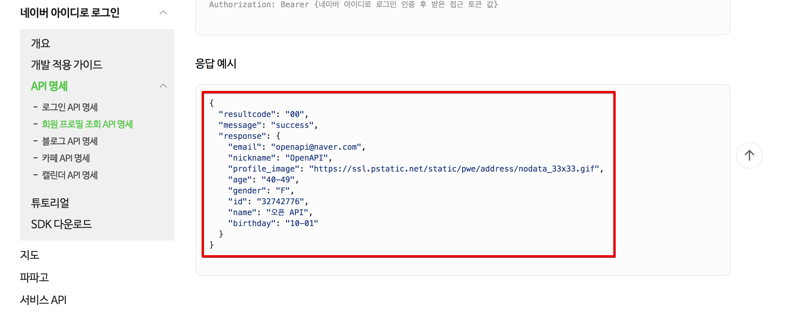

([네이버 회원 정보 조회 API](https://developers.naver.com/docs/login/profile/))

이걸 참고해서 우린 DTO 클래스를 생성해야하는데요.  
만약 사용해야하는 API가 한두개가 아니면 어떡하나요?  
이때 이 필드를 한땀한땀 다 치는건 너무 비생산적 아닐까요?  
그래서 이 JSON 코드를 POJO로 쉽게 생성하는 플러그인을 소개드립니다.

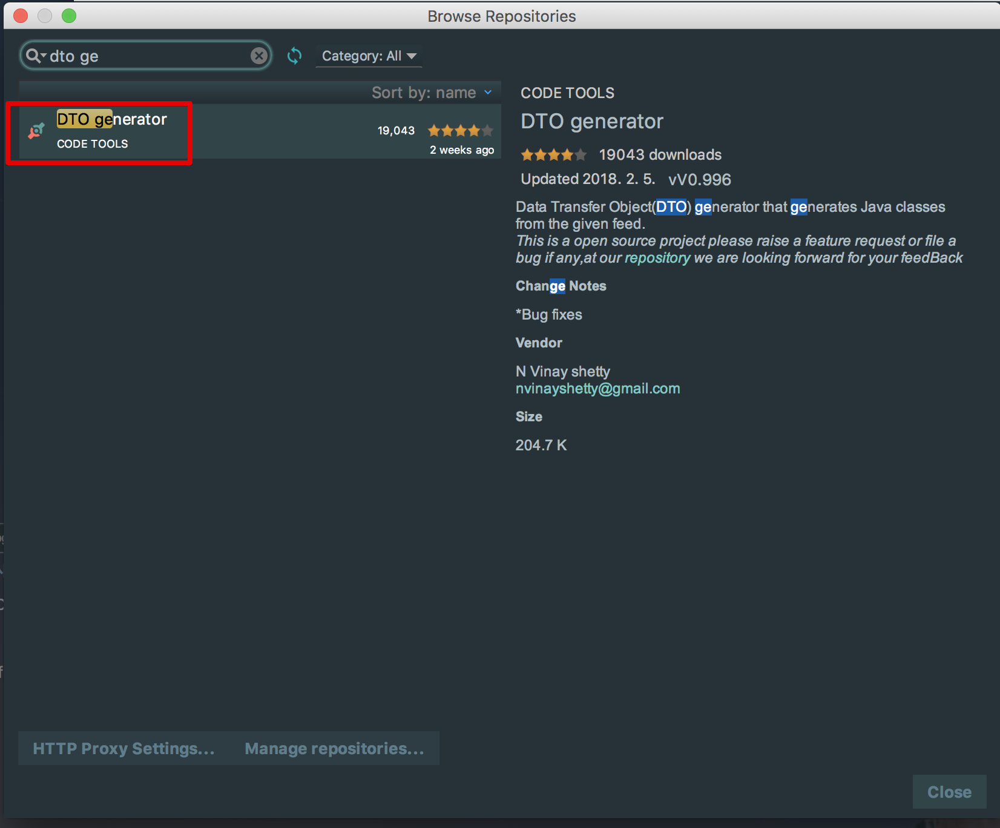

([DTO generator](https://plugins.jetbrains.com/plugin/7834-dto-generator))  
  
이 플러그인을 설치하시고 빈 클래스에서 Generate를 하시면


(맥 기준 단축키: ```command+n```)  
  
여기서 **DTO from JSON**을 선택합니다.  
그럼 아래와 같이 팝업메뉴가 등장합니다.

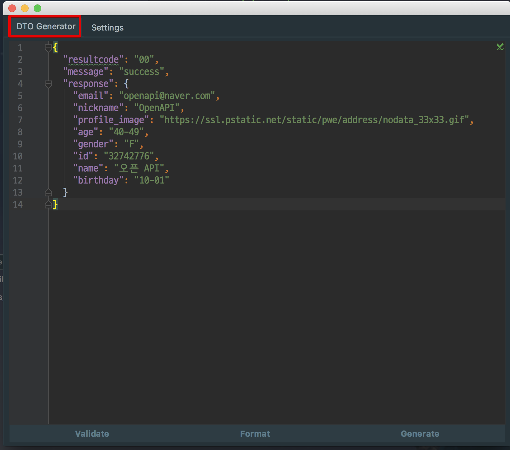

여기에서 바로 우측 하단의 **Generate**를 클릭하시면 클래스의 필드가 자동생성되는데요!  
우측의 **Settings**를 통해 좀 더 자세하게 코드를 생성해보겠습니다.  
Settings 탭을 클릭하시면 아래와 같이 상세하게 POJO 생성 옵션을 줄수가 있습니다.

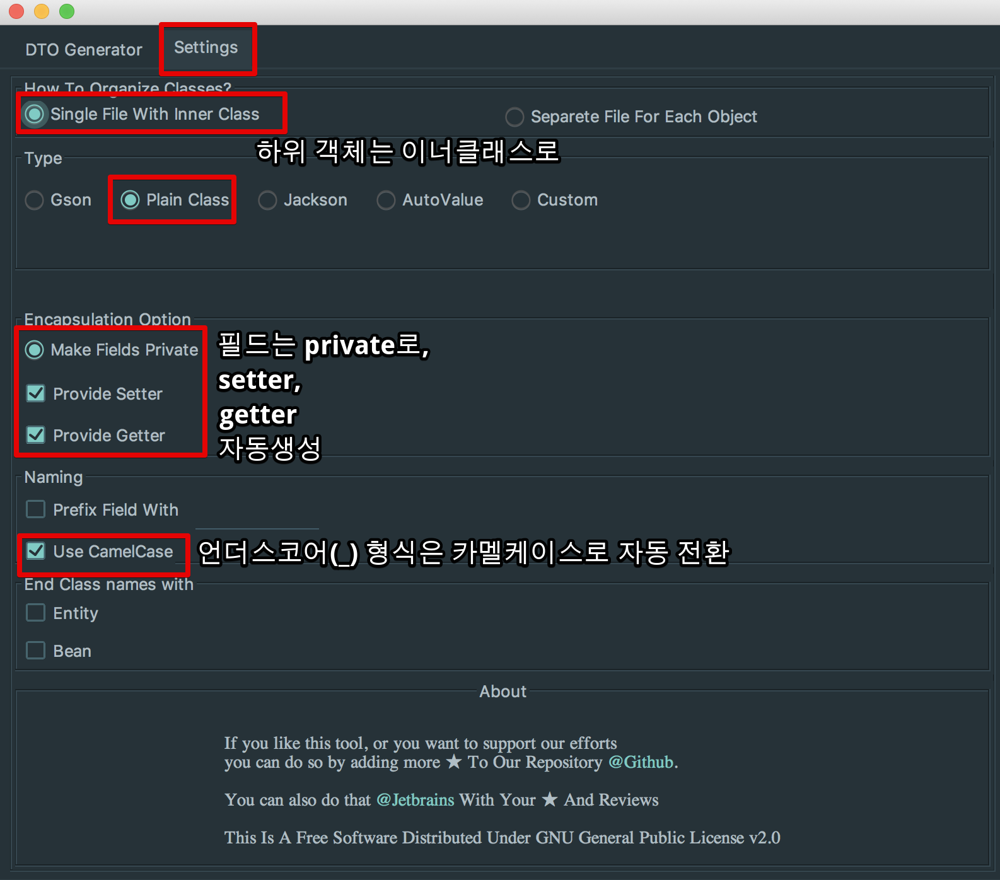

자 그럼 위와 같이 옵션을 선택하고 **Generate** 하시면!

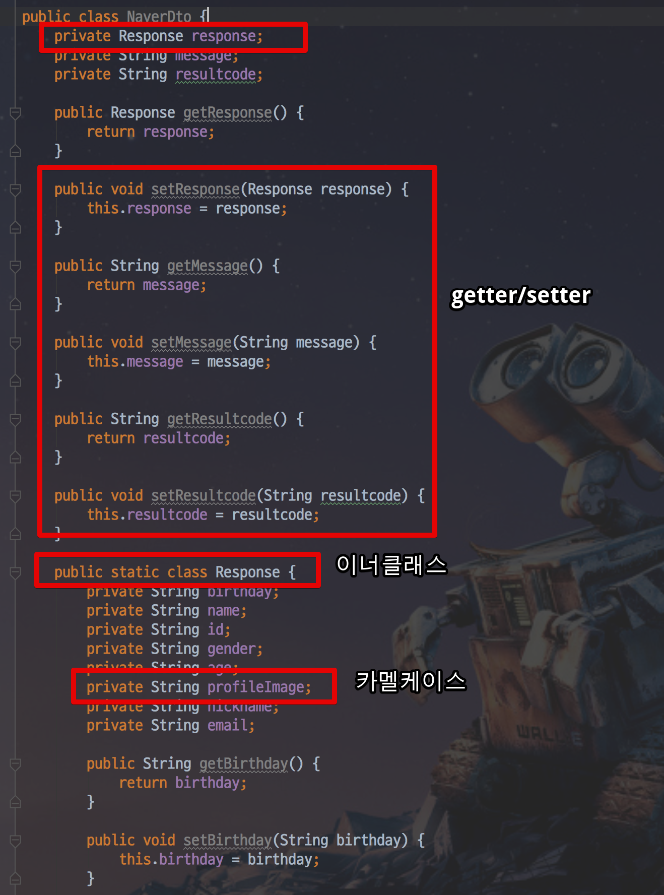

복잡한 Json도 한번에! 클래스로 생성됩니다.  
**외부 API와 연동해야할 경우 Json 코드만 있으면** 금방 코드를 생성할수 있겠죠?

## 2. POJO -> Json

이번에는 반대로 POJO 클래스를 Json으로 변경해보겠습니다.  
아래의 플러그인을 먼저 설치합니다.

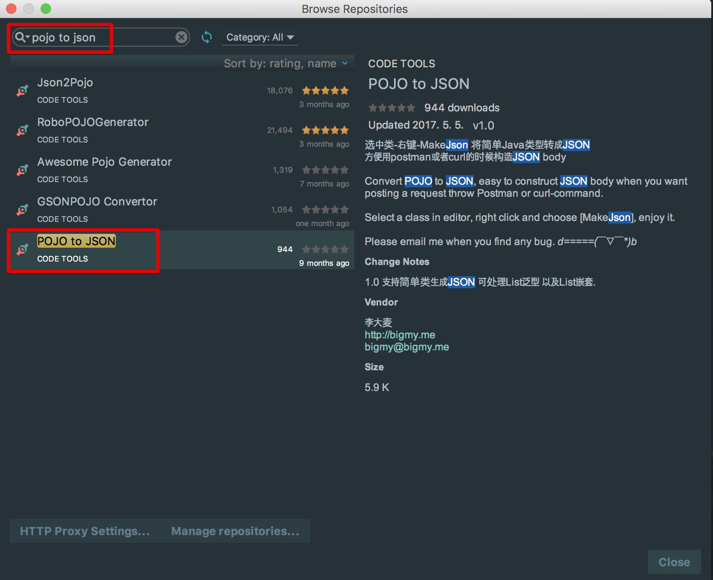

설치 및 IntelliJ를 재시작 하신뒤, 방금 만든 ```NaverDto``` **클래스 이름에서 우클릭** -> **MakeJson**을 선택합니다.

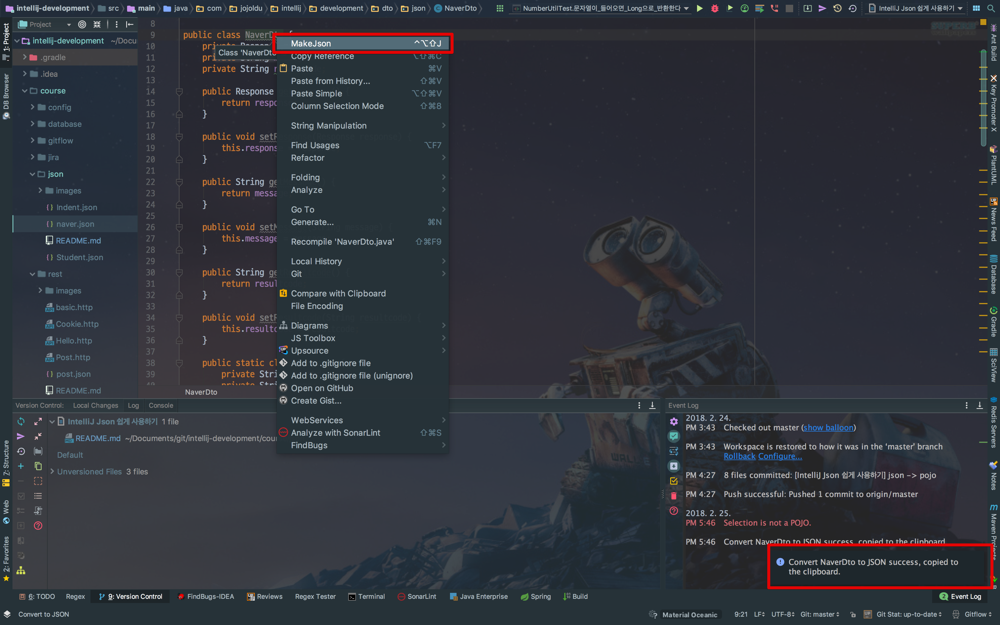

(클래스 이름 외에 다른 곳에서 우클릭 -> MakeJson 하시면 POJO가 아니라는 에러가 발생합니다.)  
  
그럼 우측 하단에 ```Convert NaverDto to JSON success, copied to the clipboard``` 메세지가 나오면 성공적으로 Json 코드로 전환되고 클립보드로 복사된 것입니다.  
  
Json 코드로 잘 복사 되었는지 확인하기 위해 naver.json 이란 파일을 생성해서 붙여넣기 (```command+v```해봅니다.)  
  
그럼!

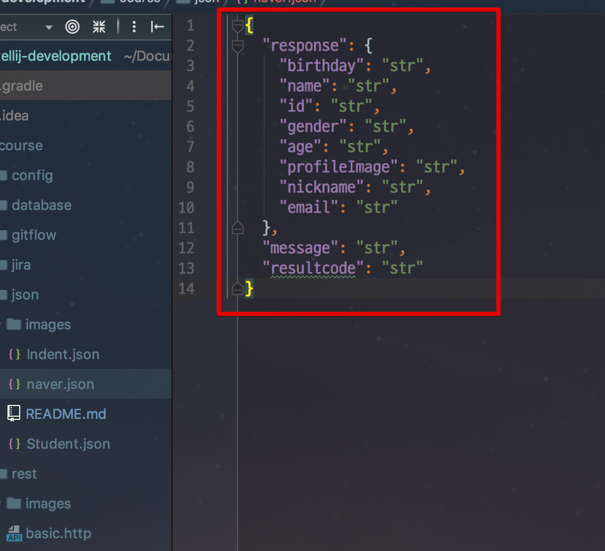

POJO 클래스가 아주 정확하게 Json 코드로 복사된 것을 확인할 수 있습니다.  
만약 외부에 API 스펙을 전달해야한다면 DTO 혹은 Entity 클래스를 그대로 Json 코드로 복사해서 전달하면 되겠죠?

## 3. 문자열에서 바로 Json String 생성하기

이번에는 Java나 Javascript와 같은 코드에서 즉시 JSON 문자열을 쉽게 생성할 수 있는 방법을 소개드리겠습니다.  
  
문자열 안에서 맥북 기준으로 ```option+enter``` -> ```Inject Language or Reference```선택합니다.

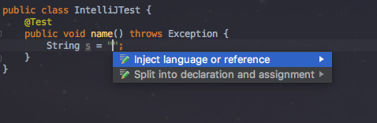

**JSON**을 선택합니다.

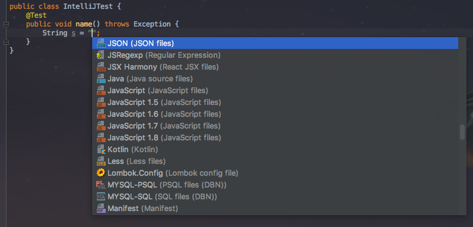

**Edit JSON Fragement** 선택합니다.

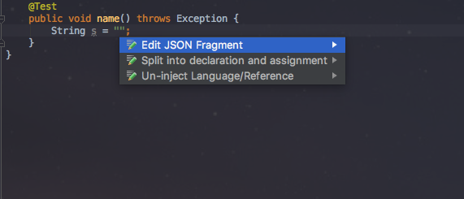

그럼 JSON 코드 사용모드가 열립니다.  
아래 하단 영역에서 JSON 입력시 자동으로 커서가 있는 곳에 ```\```추가한 JSON 형태의 문자열이 코드 작성시 자동으로 추가됩니다.

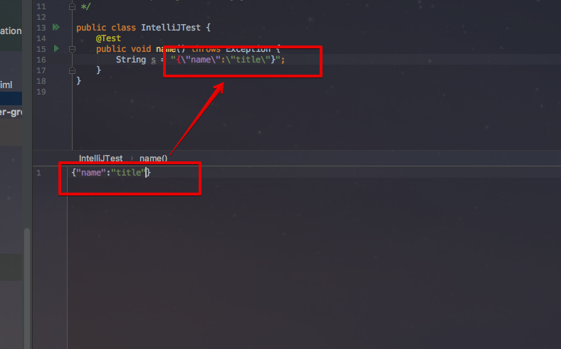

이제는 한땀한땀 개발자가 ```\"```을 넣어가며 Json 문자열을 생성할 필요가 없겠죠?

## 4. Json Format

따로 Json 파일을 생성하지 않고, 즉시 Json 코드를 확인하고 재정렬 시킬수 있는 플러그인도 있습니다.  
기존에는 어디선가 받은 Json 데이터를 정렬해서 보려면 [jsoneditoronline](https://jsoneditoronline.org/)와 같은 곳에 붙여넣기 해서 보곤 했는데요.  
이를 IntelliJ 안에서 바로 해결해보겠습니다.  
  
**JSON Viewer** 플러그인을 설치합니다.

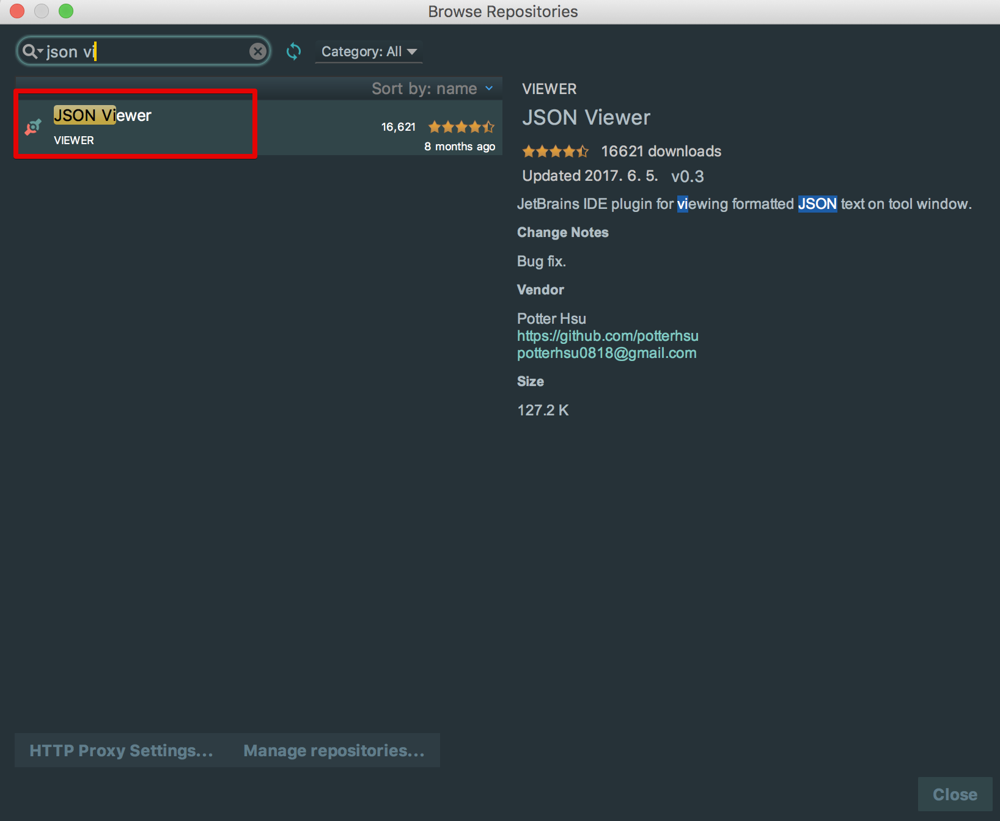

맥북 기준으로 ```command+shift+a```로 action 검색창을 열어 **JSON Viewer**를 검색합니다.

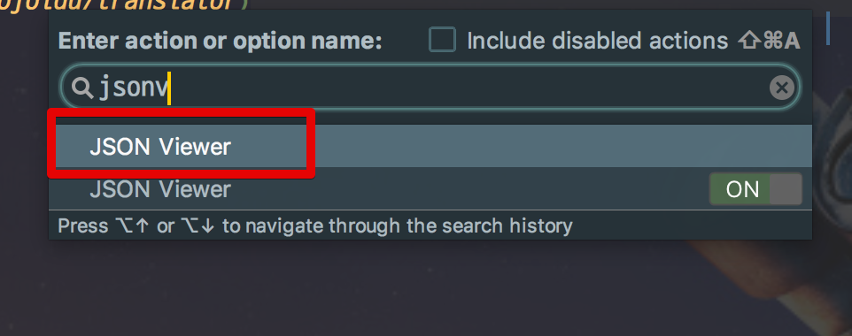

그럼 화면 우측에 JSON Viewer가 열립니다.

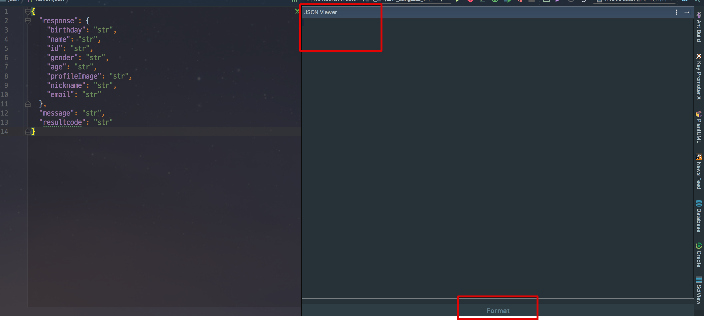

여기서 이제 원하는 JSON 코드를 바로 붙여넣으시고 하단의 Format 버튼을 클릭하시면 바로 정렬이 됩니다.  
외부의 사이트에 굳이 가실필요도,  
JSON 파일을 임의로 생성하실 필요도 없이  
여기서 바로 JSON 관련 코드를 붙여넣고 사용하시면 되겠죠?


