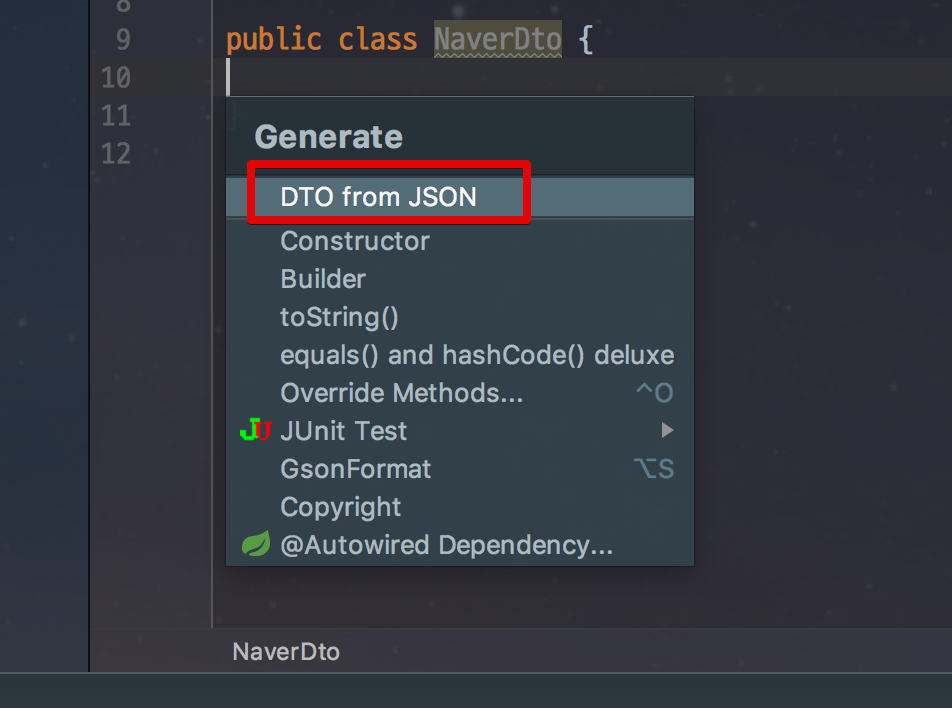

# Json 작업 쉽게 하기

안녕하세요! 이번 시간엔 IntelliJ에서 ```JSON``` 을 쉽게 사용하는 방법에 대해 소개드리겠습니다.  
모든 코드는 [Github](https://github.com/jojoldu/intellij-development)에 있습니다!  
  
개발 도중 JSON 파일이나 코드를 사용하는 일이 빈번합니다.  
그럴때마다 외부 툴의 도움을 받기보다는 IntelliJ안에서 해결하는 방법들입니다.


## 1. Json -> POJO 

가장 먼저 소개드릴 것은 **Json 코드를 POJO**로 생성하는 방법입니다.  
예를 들어 네이버 오픈 API를 통해 회원정보를 조회한다고 가정하겠습니다.  
그럼 API 문서가 다음과 같이 결과물 Json 코드를 제공합니다.


([네이버 회원 정보 조회 API](https://developers.naver.com/docs/login/profile/))

이걸 참고해서 우린 DTO 클래스를 생성해야하는데요.  
만약 사용해야하는 API가 한두개가 아니면 어떡하나요?  
이때 이 필드를 한땀한땀 다 치는건 너무 비생산적 아닐까요?  
그래서 이 JSON 코드를 POJO로 쉽게 생성하는 플러그인을 소개드립니다.


([DTO generator](https://plugins.jetbrains.com/plugin/7834-dto-generator))  
  
이 플러그인을 설치하시고 빈 클래스에서 Generate를 하시면



(맥 기준 단축키: ```command+n```)  
  
여기서 **DTO from JSON**을 선택합니다.  
그럼 아래와 같이 팝업메뉴가 등장합니다.


여기에서 바로 우측 하단의 **Generate**를 클릭하시면 클래스의 필드가 자동생성되는데요!  
우측의 **Settings**를 통해 좀 더 자세하게 코드를 생성해보겠습니다.  
Settings 탭을 클릭하시면 아래와 같이 상세하게 POJO 생성 옵션을 줄수가 있습니다.


자 그럼 위와 같이 옵션을 선택하고 **Generate** 하시면!


복잡한 Json도 한번에! 클래스로 생성됩니다.  
외부 API와 연동해야할 경우 Json 스펙만 있으면 금방 코드를 생성할수 있겠죠?

## 2. POJO -> Json


## 3. 문자열에서 바로 Json String 생성하기


## 4. Json Format

JSON Viewer 
