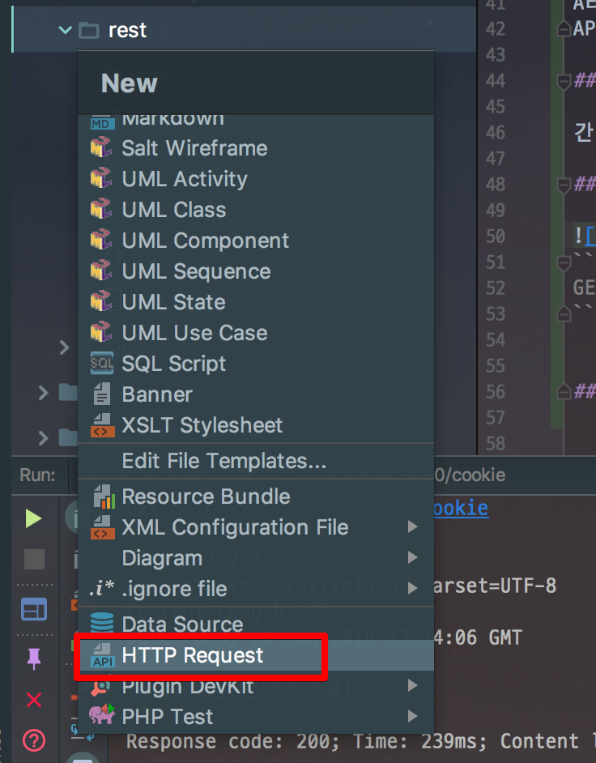
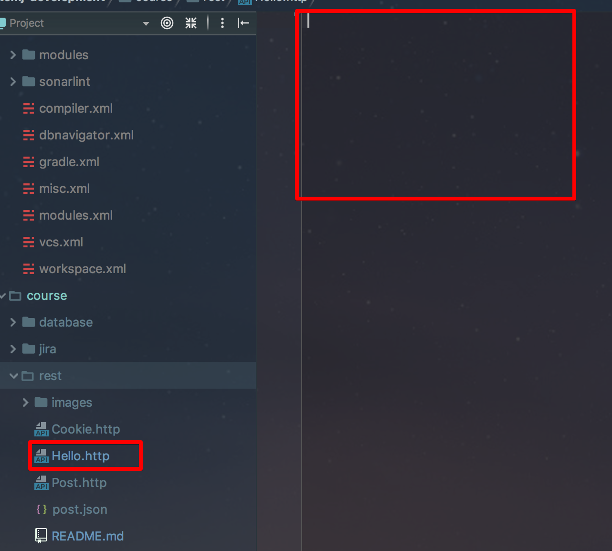
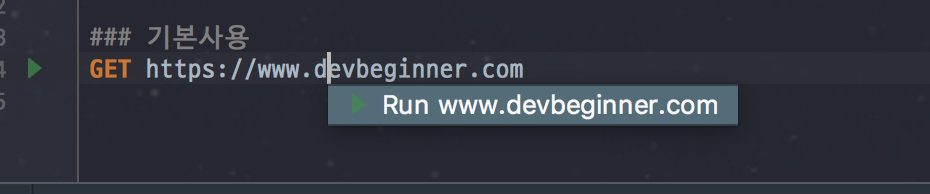
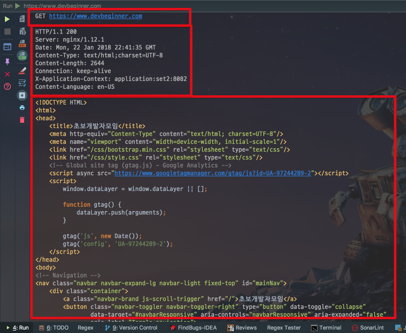
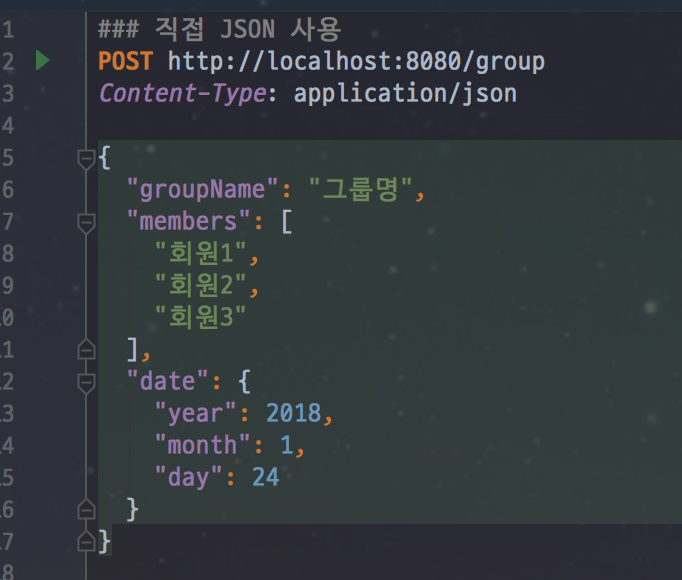
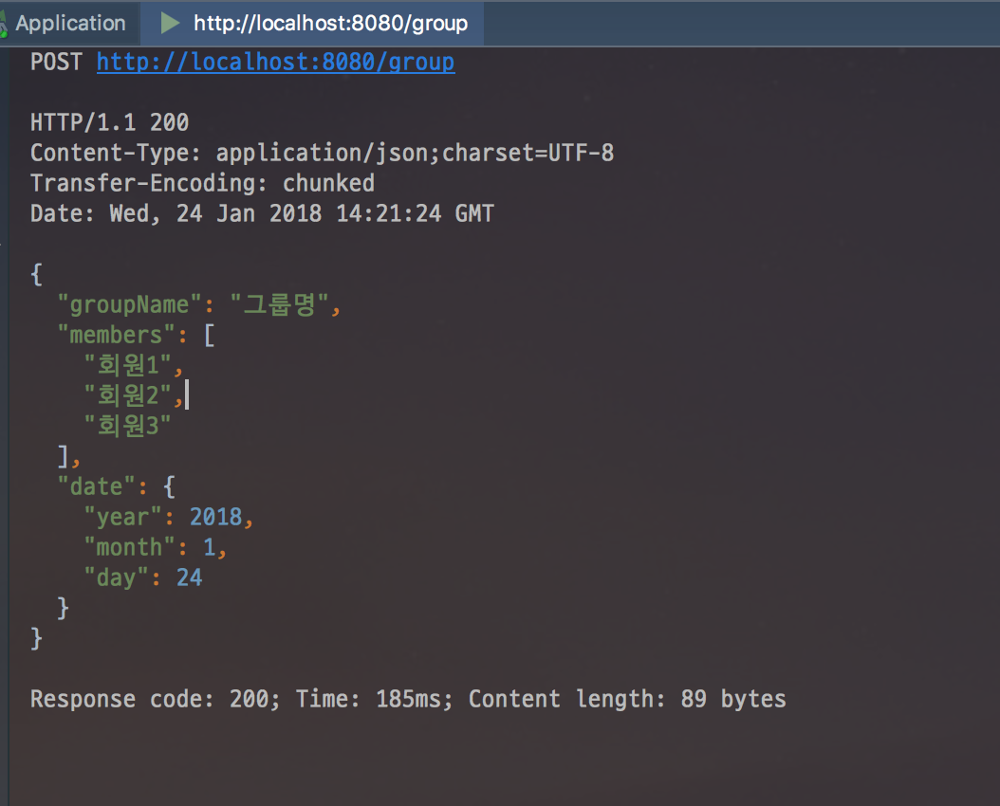
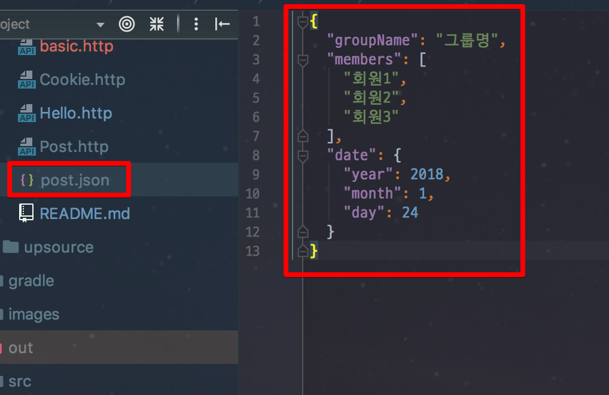
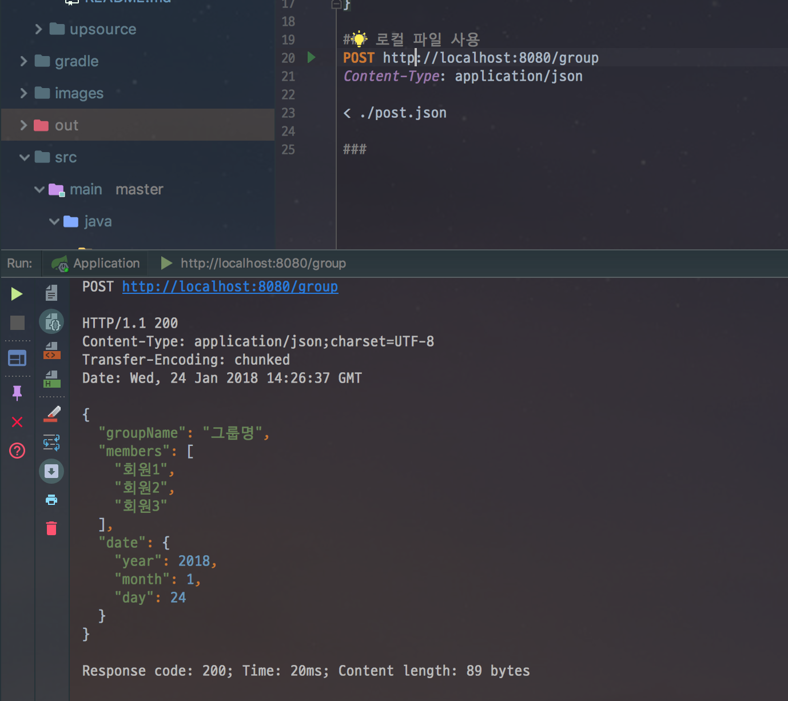

# .http를 사용해 Postman 대체하기

안녕하세요! 이번 시간엔 IntelliJ의 ```.http``` 파일을 어떻게 사용하는지 소개드리겠습니다.  
모든 코드는 [Github](https://github.com/jojoldu/intellij-development)에 있습니다!

## 소개

프로젝트를 계속 운영하다보면 **로컬 환경외에 개발/운영 환경에서 API 요청이 잘되는지 확인**이 필요할때가 많습니다.  
  
* 베타/운영 서버의 A API 값이 안나와요. 확인좀 해주세요.
* 베타 서버의 B API 사용해보려면 어떻게 해야 하나요?
* 전에 사용했던 API URL과 인증키가 어떻게 되나요?
  
등등의 요청이 많은데요.  
특히 인증 토큰등을 사용하는 경우나, 쿠키가 필요한 경우와 같이 Request 방식이 복잡하거나 할때는 대략 난감할때가 종종 있습니다.  
  
물론 [Swagger](http://jojoldu.tistory.com/31)와 같은 API 프레임워크를 사용할수 있겠지만, 회사 팀 단위로 쓸때는 바로 적용하기 어려울때도 있고 당장 급할때 적용하기가 부담스러울수도 있습니다.  
  
이런 문제점들로 계속 Postman만 사용해오셨다면, IntelliJ 2017.3 버전부터 지원하게 된 ```.http``` 를 사용해보시는걸 추천드립니다.

## 장점

앞으로 소개드릴 ```.http```의 장점은 크게 2가지가 있다고 생각합니다.

### IntelliJ 기능 지원

IntelliJ에서 작성하기 때문에 아래의 기능들이 모두 지원됩니다.

* Code highlighting
* 코드 자동 완성
* 직관적인 HttpRequest 구조
* Request Body에 쓸 JSON 등 적극적 지원 (Language injections)
* 리팩토링

IntelliJ로 코드를 작성할때 얻는 장점이 모두 포함됩니다.

### 파일 관리

모든 요청이 ```.http```라는 파일로 관리 되기 때문에 **Git으로 관리**할 수가 있습니다.  
이건 특히나 큰 장점인데요.  
A라는 사람이 만든 ```.http```는 Git Push만 하면 누구든 사용할수 있게 되고, 혹시나 누가 삭제했다 하더라도 언제든지 Git History를 통해 되살릴수 있습니다.  
API 요청 방법의 변경 내역도 언제든지 확인할 수 있습니다.  

## 사용법

간단한 예제부터 하나씩 진행해보겠습니다.

### 1. 기본 GET 요청

가장 먼저 ```.http``` 파일을 생성해보겠습니다.  
프로젝트 폴더 구조에서 ```command+n```(Mac OS 기준)으로 new 메뉴를 열어 **HTTP Request**를 선택하고 파일명을 입력합니다.  



그럼 아래와 같이 (저는 파일명을 Hello로 했습니다.) ```.http```파일이 생성됩니다.  



여기에 간단하게 GET 요청을 한번 날려보겠습니다.  
사용법은 간단합니다.  
Http Request 스펙처럼 작성해주시면 됩니다.

```
GET https://www.devbeginner.com
```

> Tip)  
즉, 파일의 **첫줄에는 HTTP Method와 URL**을,
**둘째줄부터는 RequestHeader** 부분을 작성해주시면 됩니다.

작성하셨으면 실행을 해야하는데요.  
아래와 같이 URL 위치에 Focus를 두고, ```option+enter```(Mac OS 기준)을 실행하면 **Run URL**이 등장합니다.  
바로 엔터를 치면 실행됩니다.



요청의 결과가 바로 IntelliJ 화면 하단에 등장합니다!



브라우저의 개발자도구로 보는것처럼 Response Header와 Body가 상세하게 나오는데요.  
특히 **HTML이 반환될때는 IntelliJ의 코드 하이라이팅이 그대로 적용**되서 보이기 때문에 굉장히 직관적입니다.  
자 그럼 이제 좀 더 다양한 Request 방법을 사용해보겠습니다.

### 2. Post 요청

이번엔 JSON 데이터를 Post 요청해보겠습니다.  
테스트 Request 요청을 받아줄 간단한 RestController를 생성하고 테스트를 진행하겠습니다.

```java
@RestController
public class PostController {

    @PostMapping("/group")
    public GroupDto post(@RequestBody GroupDto groupDto){
        return groupDto;
    }

    @Setter
    @Getter
    @NoArgsConstructor
    private static class GroupDto {
        private String groupName;
        private List<String> members;
        private DateObj date;

        @Setter
        @Getter
        @NoArgsConstructor
        private class DateObj {
            private int year;
            private int month;
            private int day;
        }
    }
}
```

빠르게 클래스를 생성후, SpringBoot로 localhost:8080으로 실행합니다.  
그리고 ```.http``` 파일에 다음과 같이 JSON POST 요청 코드를 작성합니다.

```
### 직접 JSON 사용
POST http://localhost:8080/group
Content-Type: application/json

{
  "groupName": "그룹명",
  "members": [
    "회원1",
    "회원2",
    "회원3"
  ],
  "date": {
    "year": 2018,
    "month": 1,
    "day": 24
  }
}
```



흔히 사용하는 JSON과 동일한 형태로 작성하면 됩니다.  
보시면 ```Content-Type``` 역시 간단하게 지정할 수 있습니다.  
이렇게 해서 요청을 보내보시면!



아주 잘 수행됐음을 알 수 있습니다.  
자 여기서 Post 예제를 하나더 진행해보겠습니다.  
  
Post로 JSON 데이터를 보낼때는 복잡한 형태가 많아서 실제 파일채로 보내고 싶을때가 있습니다.  
IntelliJ의 ```.http```는 파일 데이터도 그대로 보낼 수가 있습니다.  
예제로 ```post.json``` 파일을 하나 만들겠습니다.



그리고 이 파일을 보낼 코드는 아래와 같습니다.

```
### 로컬 파일 사용
POST http://localhost:8080/group
Content-Type: application/json

< ./post.json
```

꺽쇠(```<```)를 기준으로 파일 위치를 지정하시면 해당 파일의 데이터를 전송합니다.  



### 3. Request Header 수정해서 요청

### 4. Cookie 수정해서 요청

### 5. Log

## 마무리

어떠셨나요?  
그간 Postman을 사용하면서 만났던 불편함이 어느정도 해소되셨나요?  
개인적으로 IntelliJ의 2017.3 버전에 추가된 기능 중 가장 마음에 드는 기능입니다.  
점점더 IntelliJ가 진짜 IDE (통합 개발 환경)이 되는것 같습니다.  
또 좋은 기능과 플러그인을 발견하게 되면 정리해서 공유드리겠습니다.  
고맙습니다^^

## 참고

* [REST Client in IntelliJ IDEA Code Editor](https://www.jetbrains.com/help/idea/rest-client-in-intellij-idea-code-editor.html)