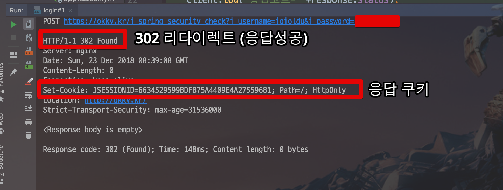

# IntelliJ http Client 응답값 변수로 저장하고 사용하기

이전에 IntelliJ로 Postman을 대체할 수 있는 ```.http```에 대해서 소개를 드렸습니다.

* [IntelliJ의 .http를 사용해 Postman 대체하기](https://jojoldu.tistory.com/266)

이 중 응답 결과를 통해 **다음 요청을 수정하는 방법**에 대한 질문을 많이 받았습니다.  


그래서 오늘은 이 부분을 진행해보고자 합니다.  
  
실습은 많은 자바 개발자분들이 알고 계시는 [OKKY 사이트](https://okky.kr/)의 로그인 기능을 이용합니다.  
  
자 그럼 시작해보겠습니다!

## 1. Response Header 저장하기

### 1-1. OKKY 기능 확인

먼저 OKKY의 로그인 기능이 어떻게 작동하는지 확인해보겠습니다.  
아래와 같은 로그인 Form이 있으며,


로그인 버튼을 클릭할 경우 아래와 같은 요청값으로 로그인이 시도됩니다.


정리하면 OKKY에서 로그인을 위해선 아래 값들이 필요합니다.

* URL
    * https://okky.kr/j_spring_security_check
* Content-Type
    * application/x-www-form-urlencoded
* Form Data
    * j_username
    * j_password

그리고 한가지를 더 테스트 해봅니다.  
**로그아웃된 상태**로 개인 정보 수정 페이지를 이동하면 어떻게 되는지 확인합니다.

```
https://okky.kr/user/edit
```

보시는것처럼 Http Status가 500으로 되며 에러페이지로 이동합니다.


로그인 되지 않은 상태에선 500에러가 발생하는것까지 확인되었으니, IntelliJ Http Request 파일을 생성해보겠습니다.

### 1-2. IntelliJ Http로 로그인 

OKKY에서 로그인 상태 여부는 아래와 같이 **JSESSIONID 이란 Cookie** 값을 보고 판단합니다.  

;

그리고 이 쿠키는 정상적으로 로그인했을 경우 응답값으로 받을 수 있습니다.

;

그럼 OKKY의 로그인이 필요한 기능들은 모두 다 저 **쿠키 값을 헤더에 가진채로 요청하면 사용가능하다**는 의미가 되겠죠?  
  
자 그럼 IntelliJ의 ```.http```파일을 하나 생성하고 아래와 같이 코드를 입력해봅니다.


```bash
POST https://okky.kr/j_spring_security_check?j_username=본인계정&j_password=본인계정비밀번호
Content-Type: application/x-www-form-urlencoded
```

그리고 이를 한번 실행해봅니다.  
그럼 아래와 같이 응답 결과가 나오는데요.



이 응답 결과를 파싱해서 저장시켜보겠습니다.  
좀 전의 코드를 아래와 같이 수정해봅니다.


```bash
POST https://okky.kr/j_spring_security_check?j_username=본인계정&j_password=본인계정비밀번호
Content-Type: application/x-www-form-urlencoded

> 
```

* ```> ```
    * .http 파일의 응답 결과를 다루는 스크립트 코드 선언문입니다.
    * 위 코드안에서만 스크립트가 작동합니다.
* ```client.global.set```
    * ```client.global```은 현재 실행하는 IntelliJ ```.http```파일을 얘기합니다.
    * ```set```을 통해 현재의 ```.http```파일 어디서든 사용할 수 있는 전역변수를 선언합니다.
* ```response.headers.valueOf```
    * ```response```: 실행한 요청의 결과를 담는 변수입니다.
    * ```response.headers```: 요청의 결과 중 HTTP Header에 담긴 값들을 나타냅니다.
        * 이외에 ```body```도 있습니다.
    * ```.valueOf("Set-Cookie")```: Header의 값 중 쿠키값인 ```Set-Cookie```을 가져옵니다.
* ```client.log```
    * 스크립트 실행중 필요한 내용을 로그로 출력하는 기능입니다.
* ```client.global.get("JSESSIONID")```
    * 전역 변수로 선언된 값중 하나를 가져옵니다.
    * 여기선 ```client.global.set("JSESSIONID")```로 저장한 값을 가져옵니다.

재밌는 것은 IntelliJ의 ```.http```는 Javascript 기반으로 작동되어 Javascript의 기능을 사용할 수 있습니다.  
여기서 ```response.headers.valueOf("Set-Cookie")```에서 나온 값이 ```JSESSIONID=086C6DDE50F7809B8DD8AB9C6F6D5422; Path=/; HttpOnly```이기 때문에 Javascript의 문자열 기능 중 하나인 ```split``` 메소드를 이용해서 ```JSESSIONID```값만 추출한 것입니다.  
  
다시 한번 ```.http```파일을 실행해봅니다.  
그럼 아래와 같이 응답 결과가 나옵니다.  
여기서 쿠키의 JSESSIONID 값을 확인하신뒤,


콘솔 바로 위에 있는 탭 중 **Response Handler** 탭을 클릭해보시면 아래와 같이 핸들러 스크립트에서 작성한 ```client.log```가 잘 출력되고 있음을 확인할 수 있습니다.


제대로 JSESSIONID가 추출되어 글로벌 변수로 잘 저장되었죠?  
그럼 이 쿠키값을 이용해 사용자정보 수정하기 페이지를 이용해보겠습니다.

### 1-3. 글로벌 변수 사용하기 


## 2. 테스트 코드 작성

```bash
### OKKY 개인정보 수정페이지 호출3
GET https://okky.kr/user/edit
Cookie: JSESSIONID={{JSESSIONID}}

> 
```

## 참고

* [handling-reponses-in-the-http-client](https://blog.jetbrains.com/phpstorm/2018/04/handling-reponses-in-the-http-client/)