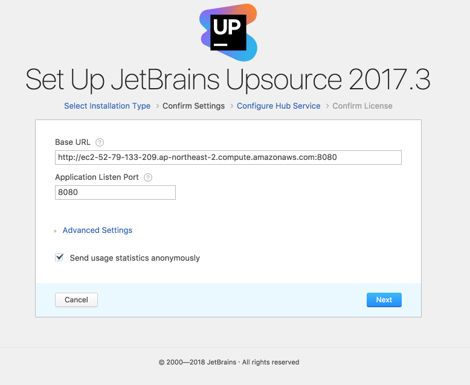

# Upsource 설치 및 기본 사용법

IntelliJ, Webstorm 등을 개발하는 Jetbrains에서 코드리뷰 툴인 Upsource를 개발했습니다!  
  
같은 Jetbrains 계열의 코드리뷰 툴이라 IDE와 호환이 잘되서 리뷰가 굉장히 편리합니다.  
(Github으로 코드리뷰를 하면서 IDE와 호환이 되면 정말 좋겠다란 생각을 하시던 분들에겐 희소식일것 같습니다.)  
현재 10명까지 무료로 사용할 수 있기 때문에 소규모 팀에서 사용하기에 아주 좋을것 같습니다.  

## 1. 설치

개인 서버가 없기 때문에 AWS EC2 기준으로 진행합니다.  
Jetbrains에선 EC2 [M3.large 이상을 권장](https://www.jetbrains.com/help/upsource/in-cloud-installation.html)하기 때문에
사내에서 원할하게 쓰시고 싶으신 분들은 **M3.large** 이상을 사용하시고, 
개인이 쓰신다면 프리티어 내에서 사용하시면 될것 같습니다.  

### 1-1. Java 8 설치

2018.01.05 기준으로 현재 AWS EC2는 Java7을 기본 설치되어있으나, Upsource는 Java8이 필요해 Java8을 설치하겠습니다.  
AWS EC2에 접속하셔서 Java8을 설치합니다.

```bash
sudo yum install -y java-1.8.0-openjdk-devel.x86_64
```

설치가 완료되셨으면 인스턴스의 Java 버전을 8로 변경하겠습니다.

```bash
sudo /usr/sbin/alternatives --config java
```


버전이 변경되셨으면 사용하지 않는 Java7을 삭제합니다.

```bash
sudo yum remove java-1.7.0-openjdk
```

### 1-2. Upsource 설치

Upsource의 AWS 설치 링크가 별도로 없기 때문에, 로컬에서 ZIP 파일을 받아 scp로 전송해야합니다.  

* [다운로드 링크](https://www.jetbrains.com/upsource/download/#section=linux)

AWS EC2에 접속해 /home/ec2-user 에 upsource 디렉토리를 생성합니다.

```bash
mkdir ~/upsource
```
scp로 로컬에 받은 upsource zip파일을 EC2 upsource 디렉토리로 복사합니다.

```bash
scp -i ~/.ssh/pem파일 다운받은upsource.zip ec2-user@AWS의ip:/home/ec2-user/upsource
```

해당 EC2 서버에 접속해서 zip 파일 압축을 풀겠습니다.

```bash
unzip upsource-2017.3.2593.zip
```

압축을 풀고 Linux의 리소스 설정값을 Upsource에 맞게 [설정](https://www.jetbrains.com/help/upsource/3.0/things-to-configure-before-starting-upsource.html)합니다.

```bash
sudo vim /etc/security/limits.conf
```

변경할 설정값은 아래와 같습니다.

```bash
- memlock unlimited
- nofile 100000
- nproc 32768
- as unlimited
```


설정이 끝나셨으면 Upsource의 포트번호와 URL을 설정하겠습니다.  
포트를 8080으로 지정하고, base url로 AWS EC2의 public DNS + 8080을 지정합니다.

```bash
cd /home/ec2-user/upsource/upsource-2017.3.2593
sudo bin/upsource.sh configure --listen-port 8080 --base-url http://EC2퍼블릭DNS:8080
```


설정이 끝나셨으면 upsource를 실행시킵니다.

```bash
sudo bin/upsource.sh start
```

### 1-3. Upsource 웹 페이지 설정

서버에서의 설치가 끝나셨으면 base url로 지정한 주소로 브라우저에서 접근해봅니다.  
아래와 같은 화면이 나옵니다.


Set Up을 클릭하시면 서버에서 설정한 값이 그대로 확인 됩니다.  



Next를 클릭하시고,  
Use Built-in Hub를 클릭하신뒤,  
Upsource의 Root 계정을 생성합니다.


(캡쳐에선 admin으로 생성했지만, 실제로 jojoldu로 생성했습니다.)  
  
원하는 계정명으로 생성하신뒤 Next를 클릭합니다.


마지막 Finish를 클릭하시면, 아래와 같이 Dashboard가 확인됩니다.


처음 페이지에서 생성한 Root 계정으로 로그인하시면 기본 설치는 끝났습니다!  

### 1-4. Upsource Email 설정
 
