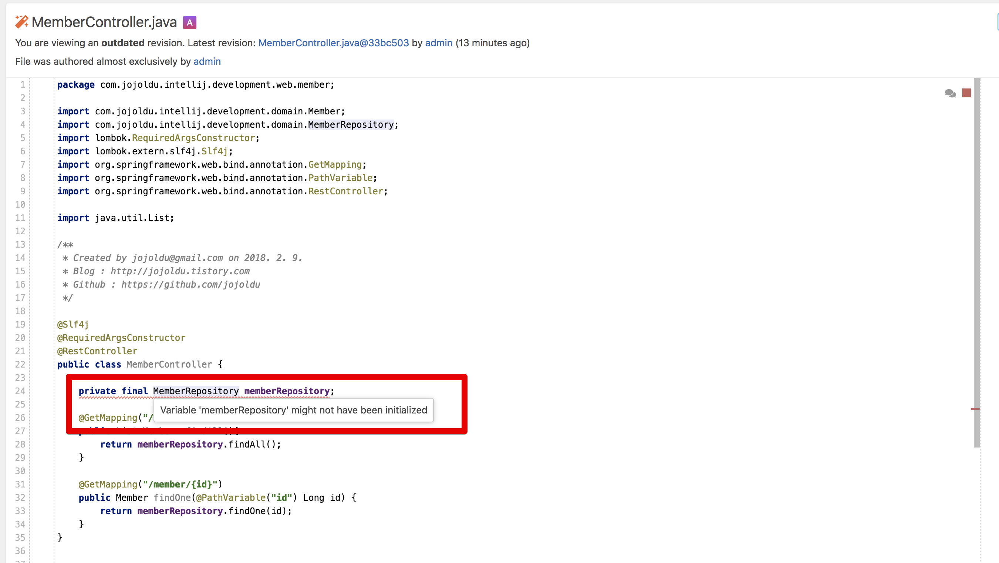

# Code intelligence

Upsource 에는 IntelliJ IDEA 만큼 다양한 코드리뷰 기능을 지원합니다.
그 중에서 **Code intelligence** 기능이 있습니다.  
프로젝트의 파일들에 대한 다양한 기능을 지원합니다.

* 코드 정적 분석
* 선택한 클래스의 원본 파일로 이동
* 해당 변수 혹은 클래스를 사용하고 있는 코드들 검색
    * IntelliJ의 Command + Shift + F로 검색하는 것과 마찬가지
* 현재 파일에서 해당 변수 사용하는 코드들 HIghlight 표기

참고로 이번 포스팅에서 사용하는 Upsource의 버전은 2018.1 입니다.  
다른 버전에서는 조금의 차이가 있을 수 있음을 미리 말씀드립니다.  
  
자 그럼 한번 시작해보겠습니다.

## 1. 설정

먼저 Upsource의 **기본 설정으로는 Code intelligence**를 사용할 수 없습니다.  
그래서 이를 위한 설정을 추가하겠습니다.  
  
먼저 Upsource로 접속하셔서, Code intelligence를 추가하고 싶은 프로젝트를 선택합니다.  
저는 여기서 intellij-development를 선택하겠습니다.


프로젝트 페이지로 이동하시면 **우측 상단의 설정 버튼**을 클릭합니다.  


프로젝트 설정 페이지에서는 **Edit project**를 클릭합니다.


여기서 Code Intelligence 탭을 클릭 하시고 아래와 같이 설정합니다.


* Enable code intelligence
* Run code inspections
* Detect automatically

이렇게 설정하신 뒤, 한가지 더 설정이 필요합니다.  
해당 프로젝트의 **```.idea``` 폴더를 해당 프로젝트의 원격 저장소에 올려야만** 합니다.


(저는 Github을 원격저장소로 쓰고 있기 때문에 Github에 올려두었습니다.)  
  
자 이제 모든 설정이 끝났으니 한번 사용해보겠습니다.

## 2. 사용

해당 프로젝트의 Upsource에서 특정 파일로 이동해봅니다.  
이동해보시면 페이지 우측 상단에 로딩 아이콘이 생깁니다.


해당 아이콘은 현재 보고 있는 페이지의 코드를 **정적 분석**하는 중입니다.  
정적 분석이 끝나면 아래와 같이 색이 있는 네모 박스로 로딩 아이콘이 변경 됩니다.  
  
그럼 정적 분석 결과가 바로 페이지에 반영 됩니다.


여기서 ```MemberRepository```에 마우스 포커스를 두시면 왜 문제가 있는지 알려줍니다.



보시는 것처럼 ```private final MemberRepository memberRepository;```의 초기값을 설정하지 않았다는 분석결과입니다.  
  
그리고 ```MemberRepository```를 클릭해보시면 다양한 Code Intelligence 기능을 볼 수 있습니다.  


전체 코드를 바로 볼 수 있는 화면과 함께 다양한 버튼들이 등장합니다.  
하나씩 알아보겠습니다.  

### Go to declaration

선택된 코드의 파일로 바로 이동하는 버튼입니다.


### Find Usages

선택된 코드를 사용하고 있는 곳을 프로젝트 전체에서 찾아줍니다.


실제로 UI가 IntelliJ IDEA와 비슷합니다.

### Highlight usages in file

선택된 코드를 현재 파일에서 사용하고 있는 곳에 하이라이트 표기를 해줍니다.  


거의 IntelliJ IDEA로 코드 리뷰하는 느낌이죠?

## 마무리

Upsource는 계속해서 코드리뷰에 도움되는 기능들이 하나둘씩 추가 되고 있습니다.  
위에서 언급한 기능들은 코드리뷰 중에 특히나 IntelliJ 없이 코드리뷰하는데 많은 도움을 주고 있습니다.  
혹시나 Upsource를 쓰고 계신 다면 꼭 적용해보시길 추천합니다.


