# 5. Upsource Project

Upsource의 프로젝트 페이지에는 많은 기능들이 있습니다.  

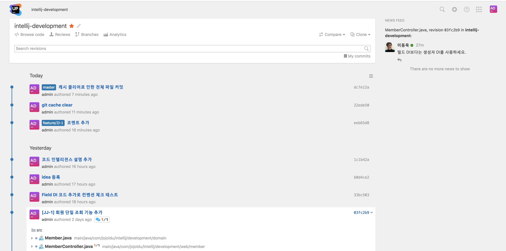

(Upsource 프로젝트 페이지)  
  
해당 기능들에 대한 전반적인 소개를 하겠습니다.  
  
## 1. Git Tree

각 커밋의 우측에 보시면 페이지를 열 수 있는 오픈 버튼이 있습니다.  
버튼을 클릭해 보시면 다음과 같이 해당 커밋에 대한 전반적인 내용을 모두 볼 수 있는데요.

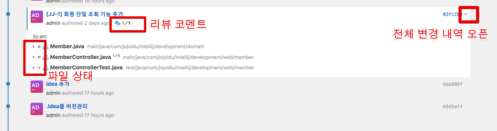

1개의 리뷰 코멘트와 3개의 변경 파일이 있음을 알 수 있습니다.  
  
특히 변경 파일의 좌측을 보시면 변경 내용에 따라 상태 버튼이 표기됩니다.

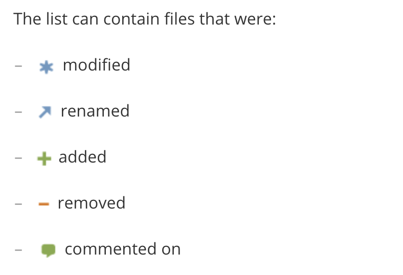

여기서는 ```Member.java```와 ```MemberController.java```는 변경을, ```MemberControllerTest.java```는 새로 생성되었음을 알 수 있습니다.  
  
각 파일에 있는 화살표 버튼을 클릭 해보시면 해당 파일의 변경내역 역시 바로 확인할 수 있습니다.  
변경 내역의 상단을 보시면 이전 Revision과 비교, 해당 File 페이지로 이동 등의 버튼이 있습니다.

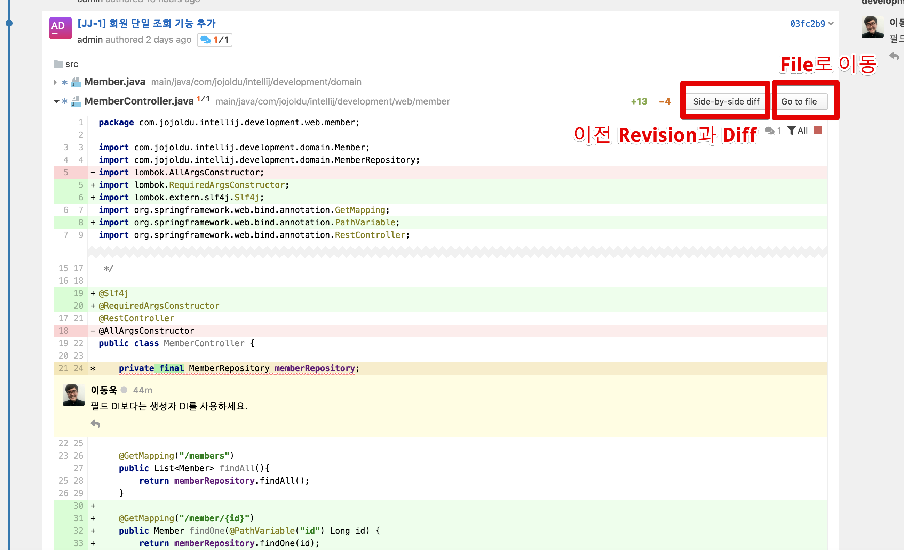

이전 Revision과 비교 (Side-by-side diff) 버튼을 클릭해서 가보시면 아래와 같이 해당 파일을 이전 버전과 바로 비교해볼 수 있습니다.

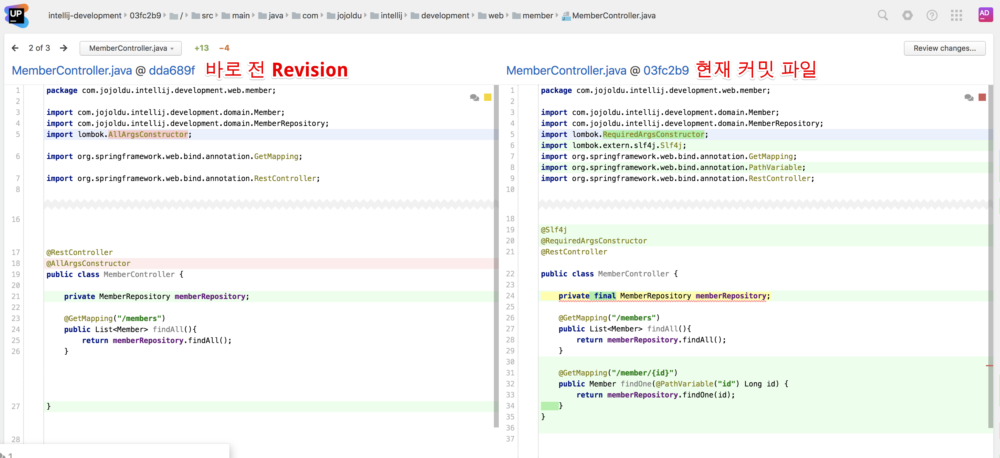

물론 이렇게 diff 페이지에서도 **Code inspection과 Code intelligence가 지원**됩니다.

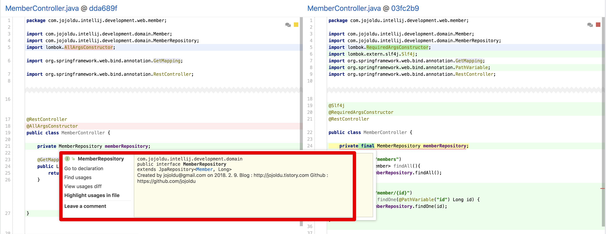


> Code inspection과 Code intelligence이 처음이신분은 이전에 작성한 [포스팅](https://jojoldu.tistory.com/352)을 참고해보세요 :)


## 2. Search

이번에 알아볼것은 검색 기능입니다.  
Upsource는 Github 보다 훨씬 파워풀한 검색 기능을 지원합니다.  
먼저 검색하고자 하는 프로젝트의 페이지로 이동합니다.  

### 전체 검색

페이지 우측 상단을 보시면 다음과 같은 검색(돋보기) 버튼이 있습니다.

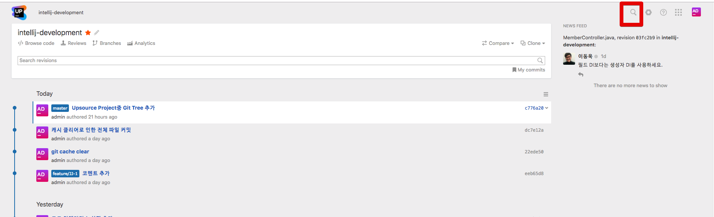

검색 버튼을 클릭하시면 검색 입력창이 등장합니다.

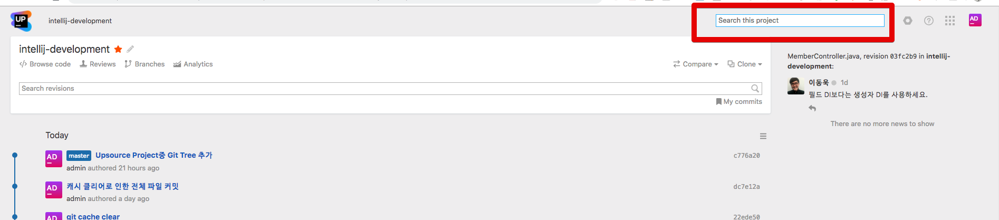

이 검색 입력창은 **현재 프로젝트의 모든 것을 검색**해줍니다.  

> IntelliJ로 치면 ```shift + shift```로 검색하는것과 비슷합니다.

이렇게 사용자 검색이나

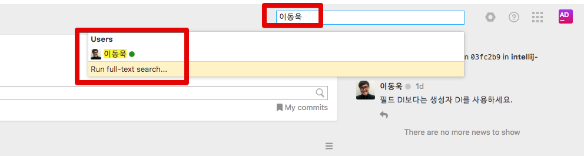

전체 텍스트 검색이 가능합니다.

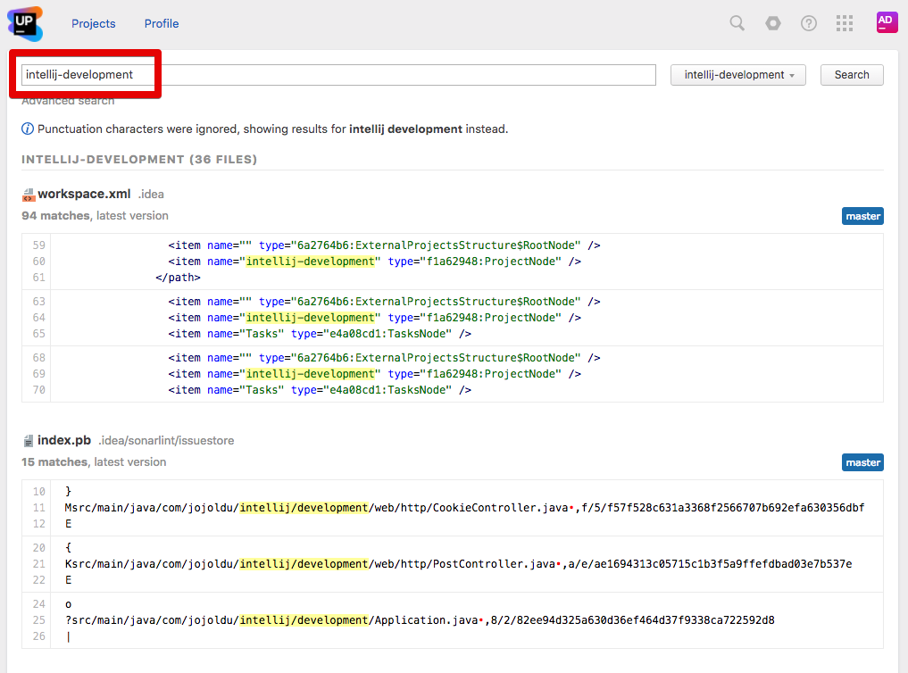

텍스트 검색 결과에서는 **프로젝트 별로 결과를 확인**할 수 있습니다.  
아래와 같이 검색창 우측에 있는 프로젝트 Select Box를 클릭하시면 프로젝트별 결과가 출력 됩니다.

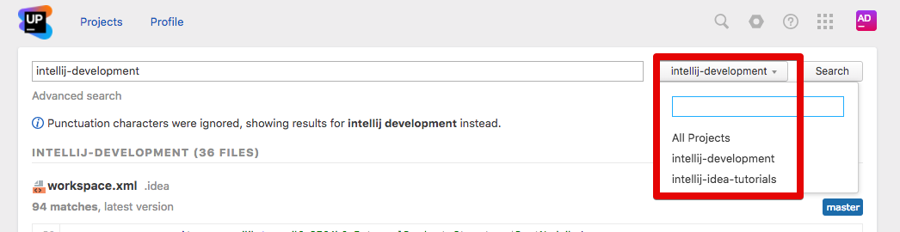

이 외에도 강화된 검색을 지원하는데요.  
검색 입력창 아래의 **Advanced search**를 클릭해봅니다.

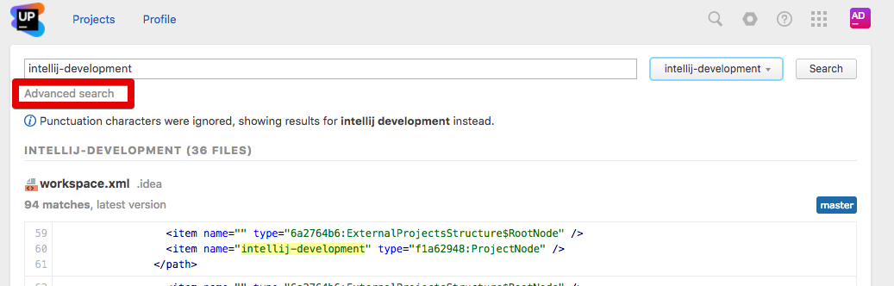

보시면 검색 결과를 **특정 파일 확장자 (혹은 패턴)** 검색이 가능합니다.  

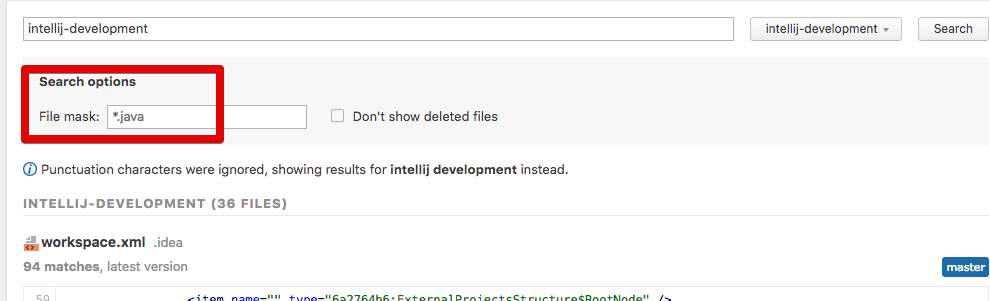

아래와 같이 ```*.xml```로 검색하시면 xml 파일들 내에서만 검색을 해줍니다.

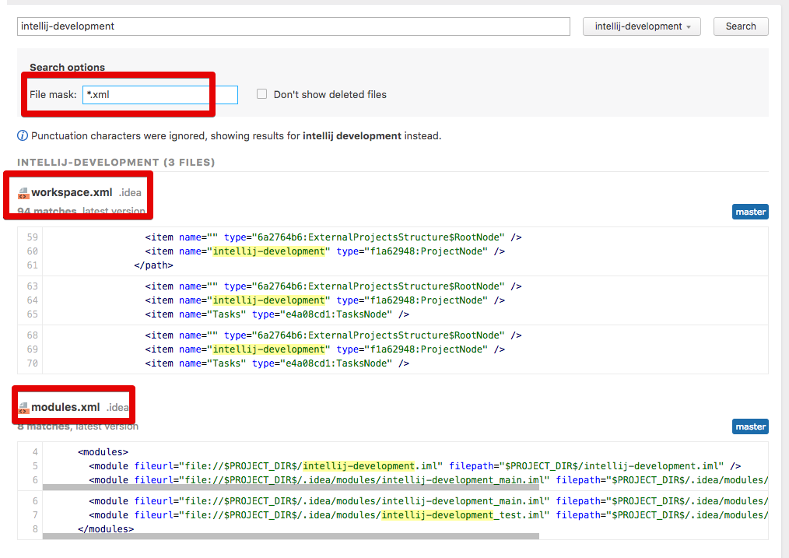


