# 1. Upsource 설치 및 설정 

IntelliJ, Webstorm 등을 개발하는 Jetbrains에서 코드리뷰 툴인 Upsource를 개발했습니다!  
  
같은 Jetbrains 계열의 코드리뷰 툴이라 IDE와 호환이 잘되서 리뷰가 굉장히 편리합니다.  
**IntelliJ에서 바로바로 코드리뷰**를 할수 있으며,  
Github보다 강화된 리뷰 기능으로 사용하시면 정말 많은 장점을 느끼실 수 있습니다.  
현재 **10명까지 무료**로 사용할 수 있기 때문에 소규모 팀에서 사용하기에 아주 좋을것 같습니다.  

## 1-1. 설치

개인 서버가 없기 때문에 AWS Amazon Linux EC2 기준으로 진행합니다.  
(Amazon Linux는 Centos기반이기 때문에 개인 Centos 서버에서 똑같은 방법으로 진행하셔도 됩니다.)  
  
Jetbrains에선 EC2 [M3.large 이상을 권장](https://www.jetbrains.com/help/upsource/in-cloud-installation.html)하기 때문에
사내에서 원할하게 쓰시고 싶으신 분들은 **M3.large** 이상을 사용하시고, 
개인이 쓰신다면 프리티어 내에서 사용하시면 될것 같습니다.  

### 1) Java 8 설치

2018.01.05 기준으로 현재 AWS EC2는 Java7을 기본 설치되어있으나, Upsource는 Java8이 필요해 Java8을 설치하겠습니다.  
AWS EC2에 접속하셔서 Java8을 설치합니다.

```bash
sudo yum install -y java-1.8.0-openjdk-devel.x86_64
```

설치가 완료되셨으면 인스턴스의 Java 버전을 8로 변경하겠습니다.

```bash
sudo /usr/sbin/alternatives --config java
```


버전이 변경되셨으면 사용하지 않는 Java7을 삭제합니다.

```bash
sudo yum remove java-1.7.0-openjdk
```

### 2) Upsource 설치

Upsource의 AWS 설치 링크가 별도로 없기 때문에, 로컬에서 ZIP 파일을 받아 scp로 전송해야합니다.  

* [다운로드 링크](https://www.jetbrains.com/upsource/download/#section=linux)

AWS EC2에 접속해 /home/ec2-user 에 upsource 디렉토리를 생성합니다.

```bash
mkdir ~/upsource
```
scp로 로컬에 받은 upsource zip파일을 EC2 upsource 디렉토리로 복사합니다.

```bash
scp -i ~/.ssh/pem파일 다운받은upsource.zip ec2-user@AWS의ip:/home/ec2-user/upsource
```

해당 EC2 서버에 접속해서 zip 파일 압축을 풀겠습니다.

```bash
unzip upsource-2017.3.2593.zip
```

압축을 풀고 Linux의 리소스 설정값을 Upsource에 맞게 [설정](https://www.jetbrains.com/help/upsource/3.0/things-to-configure-before-starting-upsource.html)합니다.

```bash
sudo vim /etc/security/limits.conf
```

변경할 설정값은 아래와 같습니다.

```bash
- memlock unlimited
- nofile 100000
- nproc 32768
- as unlimited
```

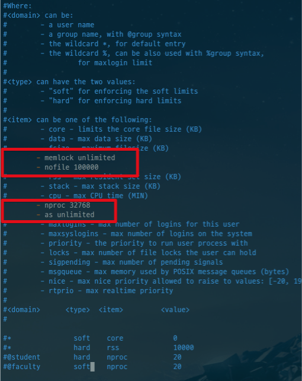

설정이 끝나셨으면 Upsource의 포트번호와 URL을 설정하겠습니다.  
포트를 8080으로 지정하고, base url로 AWS EC2의 public DNS + 8080을 지정합니다.

```bash
cd /home/ec2-user/upsource/upsource-2017.3.2593
sudo bin/upsource.sh configure --listen-port 8080 --base-url http://EC2퍼블릭DNS:8080
```

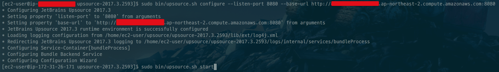

설정이 끝나셨으면 upsource를 실행시킵니다.

```bash
sudo bin/upsource.sh start
```

### 3) Upsource 웹 페이지 설정

서버에서의 설치가 끝나셨으면 base url로 지정한 주소로 브라우저에서 접근해봅니다.  
아래와 같은 화면이 나옵니다.

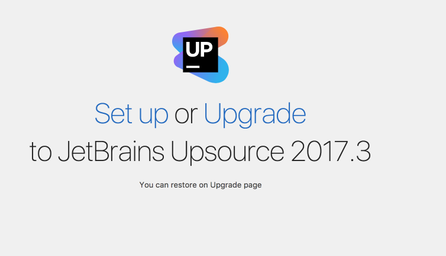

Set Up을 클릭하시면 서버에서 설정한 값이 그대로 확인 됩니다.  
Next를 클릭하시고,  
Use Built-in Hub를 클릭하신뒤,  
Upsource의 Root 계정을 생성합니다.

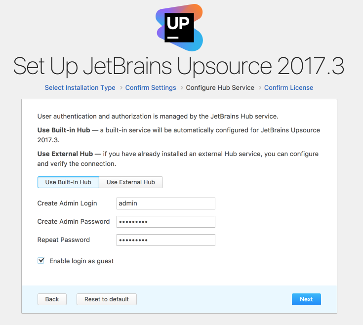

(캡쳐에선 admin으로 생성했지만, 실제로 jojoldu로 생성했습니다.)  
  
원하는 계정명으로 생성하신뒤 Next를 클릭합니다.

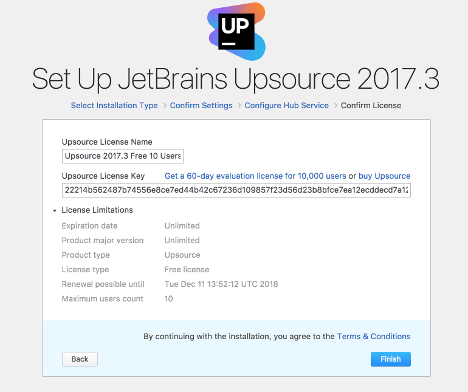

마지막 Finish를 클릭하시면, 아래와 같이 Dashboard가 확인됩니다.

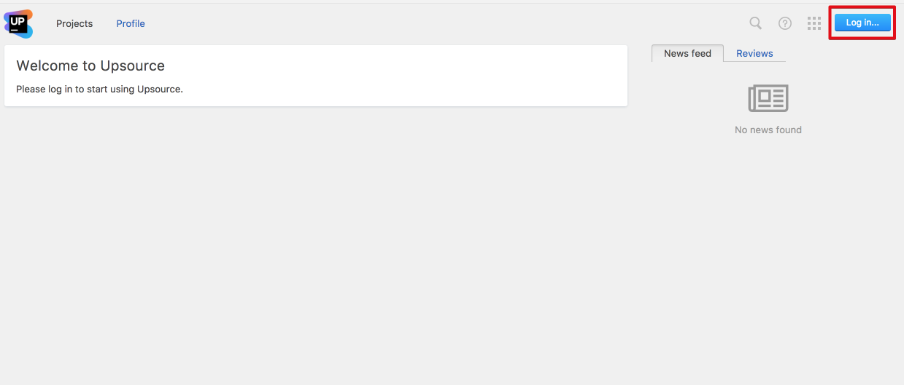

처음 페이지에서 생성한 Root 계정으로 로그인하시면 기본 설치는 끝났습니다!  

### 4) Upsource Email 설정

Upsource에서 코드리뷰 등록 및 닫기, 리뷰어 지정 및 새로운 리뷰댓글 작성과 같은 여러 이벤트에 대해 메일로 알람이 올수 있도록 Email 설정을 진행하겠습니다.  
  
AWS EC2 에선 기본적으로 sendmail 패키지가 설치되어있습니다만 혹시나 설치가 안되있으시다면 [설치 & 실행](https://zetawiki.com/wiki/CentOS_sendmail_%EC%84%A4%EC%B9%98) 까지 진행하시면 될것 같습니다.

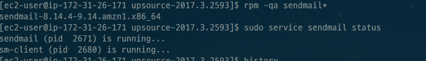

(아래의 명령어로 설치 & 실행여부를 판단합니다.)

```bash
rpm -qa sendmail*
sudo service sendmail status
```

Dashboard 우측 상단의 나사 표시 설정 버튼을 클릭합니다.

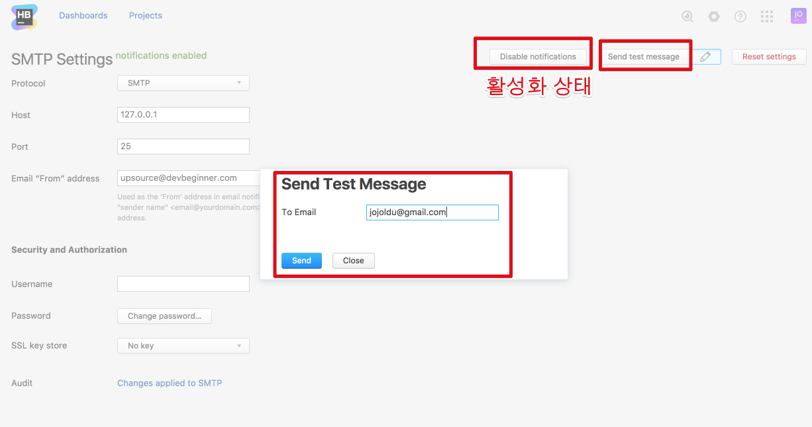

관리자 페이지로 이동이 되면, **SMTP settings for email notifications** 을 클릭합니다.


SMTP 설정 페이지에서 아래와 같이 설정값을 지정하고, **Enable notifications**를 클릭해 알람 설정을 활성화합니다.  

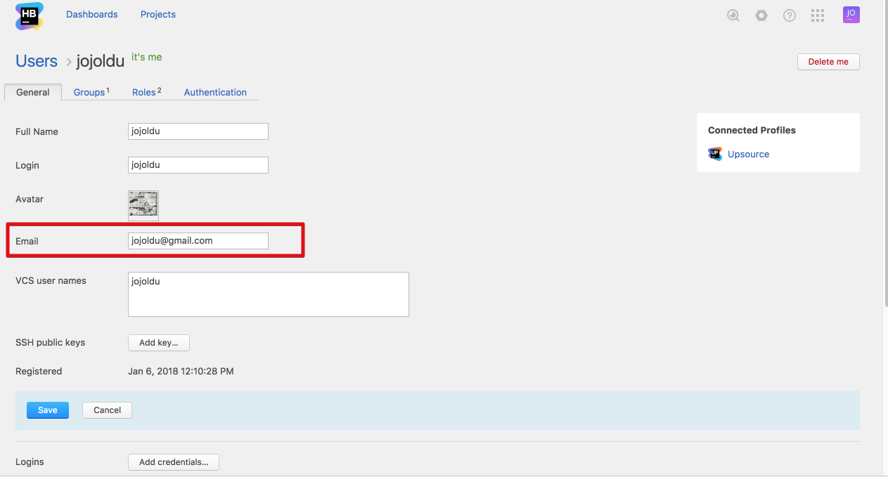

(From 이메일 주소는 아무거나 하셔도 됩니다.  
여기선 upsource@devbeginner.com으로했습니다.)
  
활성화되셨으면, 잘되는지 동일 페이지에서 **Send test message** 버튼을 클릭해서 본인 계정으로 메일 발송을 해봅니다.


메일함에 가서 확인해보면!


성공적으로 메일이 발송됐음을 확인할수 있습니다.  
(메일 서비스에 따라 스팸함에 갔을수 있습니다.  
혹시나 메일이 도착하지 않으셨다면 스팸함을 확인해보세요.)
  
Upsource의 설정이 끝났습니다!  

### 5) 계정 Email 인증

계정별로 Email 인증을 받아야 해당 계정에 발생한 Upsource 이벤트가 알람이 가기 때문에 계정 이메일 인증을 받겠습니다.  
Dashboard 우측 상단의 Profile 버튼을 클릭합니다.

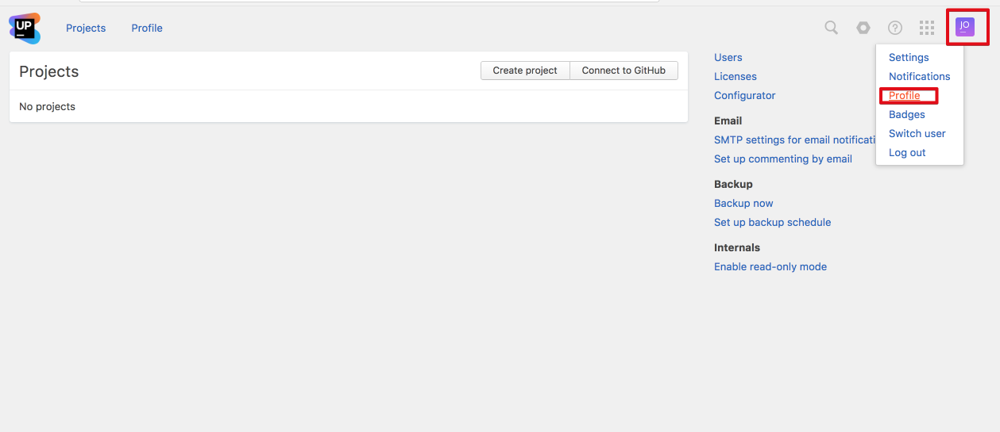

**Account settings** 을 클릭해서 계정 설정 페이지로 이동합니다.

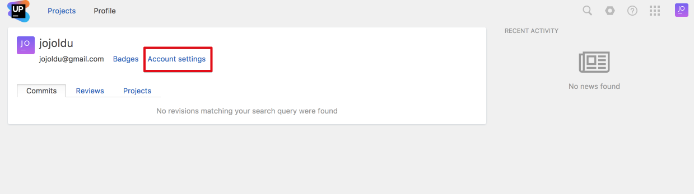

계정 설정 페이지에서 Email을 등록하고 **Send verification email** 버튼을 클릭해 인증 과정을 진행합니다.

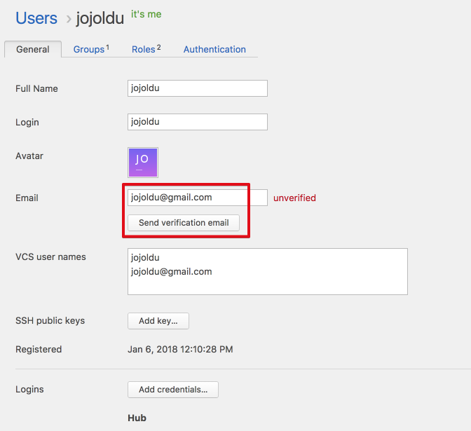

메일함에 인증 메일이 오면 인증 버튼을 클릭합니다.

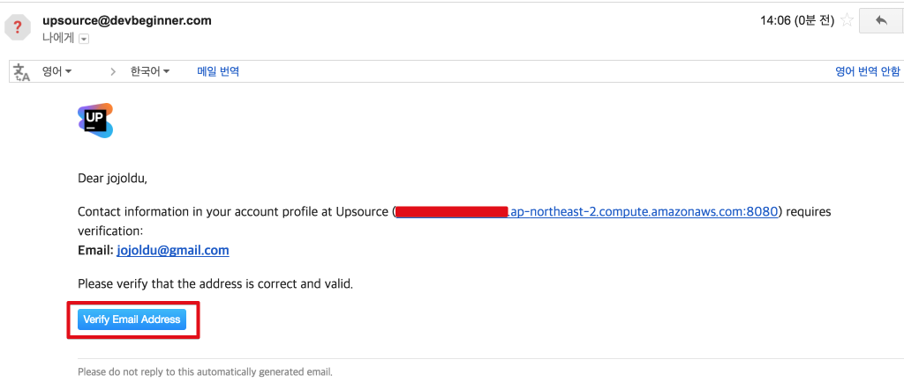

메일 인증이 완료되었습니다!

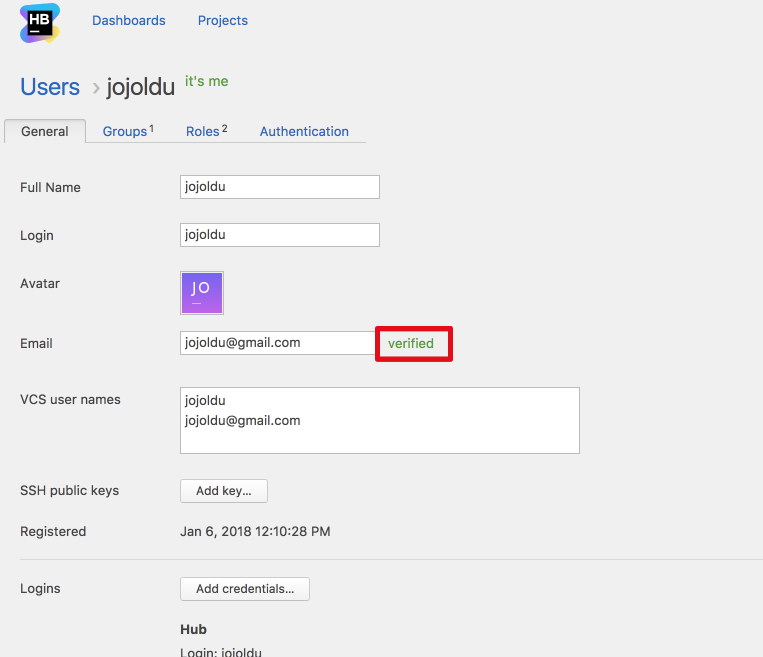

이제 Upsource를 사용할 수 있는 기본적인 환경이 구축되었습니다.  
다음 시간엔 이 Upsource를 Github, IntelliJ 에 연동하는 방법을 진행하겠습니다.  
감사합니다!


